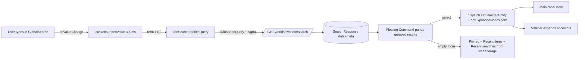
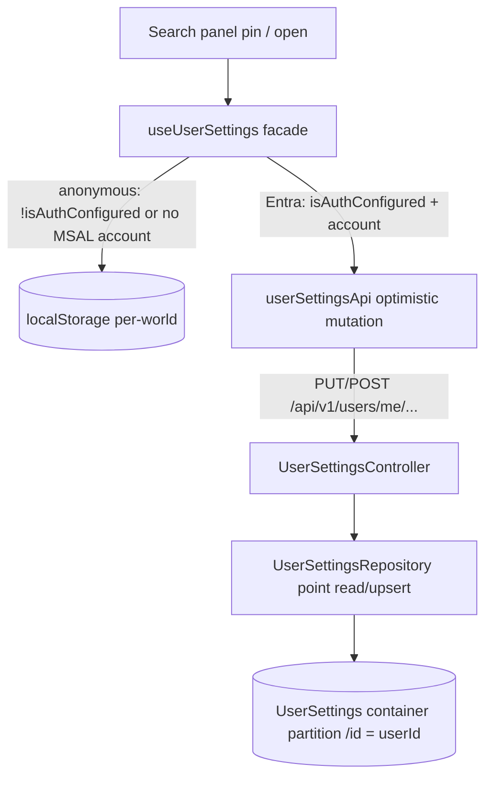

<!-- markdownlint-disable-file -->
# Task Research: Active Search Box for World Entities (Frontend)

Add an Active Search box to the top of the Libris Maleficarum frontend that performs intelligent searches (semantic, keyword, filtered) against a backend Search API over World Entities stored in the `worldentity-index`. The experience mirrors the Azure Portal search box: an active/instant search that surfaces results, search history, recent entities, and pinned entities in a floating results panel. Search is scoped to the currently selected world (with API parameters that allow cross-world filtering for future/AI use). Selecting a result opens the entity in the main panel (with hierarchy expansion); hover reveals an edit action. Must be modern, accessible, and avoid overloading the backend (debounce/throttle/cancel/cache).

## Task Implementation Requests

* Add a ShadcnUI-based Active Search component at the top of the frontend app.
* Search World Entities in `worldentity-index` via the backend Search API (semantic + keyword + filters such as World Entity Type).
* Scope search to currently selected world; expose API filter params (e.g., WorldId) so cross-world search remains possible for AI agents.
* Floating results panel that overlays all content, opens on focus, shows: results, search history, recent entities; supports pinning up to 5 entities.
* Result items show icons + metadata; click opens entity in main panel; hover reveals an edit affordance; expand collapsed hierarchy nodes to reveal the entity.
* Apply best practices to avoid backend overload (debouncing, throttling, request cancellation, caching, min query length).
* (Added in deeper research) Evaluate persisting user settings — pinned World Entities and recent searches/opened entities — in a new CosmosDB users container with backend APIs, vs browser localStorage, vs a hybrid; including the required backend model/repository/controller/EF/infra changes.
* (Added in deeper research) Resolve the five open follow-up items: search `path`/`depth` projection, canonical search endpoint, Vite dev proxy, global hotkey conflicts, and semantic-ranker wiring.

## Scope and Success Criteria

* Scope (in): A ShadcnUI `command`/`cmdk`-based active-search box in `TopToolbar`, an RTK Query injected search endpoint calling the existing backend `GET /api/v1/worlds/{worldId}/search`, a floating results panel (opens on focus) showing live results + search history + recent items + pinned items, result→open in MainPanel (view), hover→edit, hierarchy expand-to-reveal, debounce/cancellation/caching, `localStorage` persistence, WCAG 2.2 AA a11y.
* Scope (out, v1): True cross-world search (API is single-world only today — keep param design future-ready), semantic-ranker queries (backend uses hybrid/vector only), backend-synced pinned items, "recently opened" server tracking (derive client-side).
* Assumptions:
  * The backend search stack is live and reachable via the Aspire-proxied `/api` path in dev.
  * One small backend change is acceptable: add `path` (and ideally `depth`, `hasChildren`) to the search result projection so the frontend can expand the hierarchy without an extra round-trip. If not acceptable, fall back to fetching the entity by id on select to obtain `path`.
  * v1 search is scoped to the currently selected world only (`worldId` from `worldSidebar.selectedWorldId`).
* Success Criteria:
  * Authoritative backend Search API contract documented (route, request params, response shape). ✅ Done — API exists.
  * Clear frontend integration plan: placement (TopToolbar), state wiring (get world / open entity / expand ancestors), data layer (RTK Query). ✅ Done.
  * Selected approach for request management + result-panel UX with evidence-based rationale and runnable snippets. ✅ Done.
  * Identified the `path`-projection gap blocking hierarchy reveal and a recommended resolution. ✅ Done.

## Outline

1. Backend Search API — already implemented; contract, index schema, and the `path` projection gap.
2. Frontend integration — placement in TopToolbar, the three state mechanisms (get world / open entity / expand ancestors), RTK Query injected endpoint, ShadcnUI inventory.
3. Data model & entity-type registry — fields for result display, icon resolution, hierarchy representation.
4. Active-search best practices — debounce/cancellation/caching, cmdk + Popover, accessibility, persistence, UX states.
5. Selected approach (Technical Scenario) with implementation details and considered alternatives.

## Follow-Up Items — Resolved in Deeper Research

* RESOLVED — Add `path`/`depth` to the search projection: **trivial, both fields are already indexed.** Only the read path drops them. Change 4 sites (Select list, `SearchResult` projection, `SearchResult` model, `SearchResultItem` response) + the duplicated controller mapping. `hasChildren` is NOT indexed and would require an index-schema field + `SearchIndexDocument` prop + `MapToSearchDocument` + `TryMapToWorldEntity` change + full re-index → defer; `path` alone is enough to expand the sidebar. Reference: libris-maleficarum-service/src/Infrastructure/Services/AzureAISearchService.cs lines 70-71 (index), 254 (Select), 296-313 (projection).
* RESOLVED — Canonical endpoint: `GET /api/v1/worlds/{worldId}/search` (WorldsController) is the documented route but has NO ownership check (an actual auth gap — its XML docs claim 403/404 it never returns). Recommend porting the verbatim ownership block from WorldEntitiesController.cs lines 238-263 into WorldsController, then deleting the duplicate `/entities/search` action. No frontend caller exists yet. Reference: docs/design/api.md line 109.
* RESOLVED — Vite dev proxy already covers search: vite.config.ts lines 84-135 proxy `/api/v1` (+ `/api/config`) → `services__api__http__0`/`https__0` → `VITE_API_BASE_URL` → fallback `http://localhost:5077`, `changeOrigin:true`, `secure:false`. Disabled when `VITE_API_BASE_URL=http://localhost:5000` (MSW mode). vitest uses MSW (no proxy). No change needed; still add an MSW handler for the search route for tests.
* RESOLVED — No global hotkey conflicts: there is NO global `window`/`document` keydown listener and no existing ⌘K anywhere in libris-maleficarum-app/src. All handlers are local React `onKeyDown`. Adding a global Ctrl/Cmd-K is safe (mind Radix Dialog/Popover Escape handling).
* RESOLVED — Semantic ranker: index has `semantic-config` but `SearchAsync` never sets `QueryType`, so BM25/vector is always used. To enable, set `searchOptions.QueryType = SearchQueryType.Semantic` + `SemanticSearch = new SemanticSearchOptions { SemanticConfigurationName = "semantic-config" }` for non-vector modes. SKU confirmed: infra/main.bicep line 529 `semanticSearch: 'standard'` on Basic — supported, no infra change. Recommend opt-in flag / new `SemanticHybrid` mode (per-query billing + latency), NOT per-keystroke default.

## Potential Next Research

* Decide deployment target (anonymous single-user vs Entra multi-user) — this drives whether user-settings persistence is localStorage-only, backend-only, or hybrid.
  * Reasoning: in anonymous mode every request is `_anonymous`, so backend persistence only buys cross-device sync; in Entra mode it provides real per-user isolation.
  * Reference: docs/design/authentication.md lines 16-20; libris-maleficarum-service/src/Infrastructure/Services/UserContextService.cs lines 14-33
* Confirm whether `recent searches` are per-world or global-per-user, and whether recent items should auto-expire via Cosmos TTL.
  * Reasoning: affects `RecentSearch.WorldId` requiredness, route query params, and the EF config.
* Confirm caps (pinned 5/world, recent searches 10, recently opened 10) and whether pinned/recent collections are stored as real nested JSON arrays vs stringified JSON inside the point-read doc.
  * Reference: docs/design/data_model.md lines 50-58 (value-converter caveat).
* Author the `UserSettings` container row + schema in docs/design/data_model.md before finalizing types (Data-Shape Gate — it is greenfield, no user/settings concept exists today).

## Research Executed

### File Analysis

* libris-maleficarum-service/src/Api/Controllers/WorldsController.cs (lines 116-227)
  * `GET /api/v1/worlds/{worldId:guid}/search` — canonical route per design doc; binds `SearchEntitiesRequest`; returns `SearchResponse`; NO ownership check; validates `q`, `mode`, `entityType`.
* libris-maleficarum-service/src/Api/Controllers/WorldEntitiesController.cs (lines 273-323)
  * `GET /api/v1/worlds/{worldId:guid}/entities/search` — duplicate; enforces world ownership (404/403); lenient mode/type parsing.
* libris-maleficarum-service/src/Api/Models/Requests/SearchEntitiesRequest.cs (lines 7-48)
  * Query params: `q` (required), `mode` (hybrid|text|vector, default hybrid), `entityType`, `tags` (CSV), `name` (prefix), `parentId`, `limit` (default 50, clamp 1-200), `offset` (default 0). `worldId` from route.
* libris-maleficarum-service/src/Api/Models/Responses/SearchResultResponse.cs (lines 5-103)
  * Response `{ data: [{ id, name, entityType, descriptionSnippet, relevanceScore, worldId, parentId, tags[], ownerId, createdAt, updatedAt }], meta: { totalCount, offset, limit } }`. camelCase, enums as strings. NO `path`/`depth`/`hasChildren`.
* libris-maleficarum-service/src/Infrastructure/Services/AzureAISearchService.cs (SearchAsync lines 207-348; index def lines 53-138)
  * Always filters `worldId eq '{WorldId}'`; OData filters for entityType/tags/name-prefix/parentId; `Select` returns only id, worldId, entityType, name, description, tags, parentId, ownerId, createdAt, updatedAt (NOT path/depth). Modes Text/Vector/Hybrid; NO `QueryType.Semantic`. Index has `path`, `depth` as filterable fields and `semantic-config` semantic configuration.
* libris-maleficarum-service/src/Domain/Models/SearchRequest.cs, SearchResult.cs
  * `SearchRequest.WorldId` is `required` → single-world only. `SearchResult` has no `Path`.
* libris-maleficarum-app/src/App.tsx (lines 178-205)
  * Layout: `TopToolbar` header → row of `WorldSidebar` / `MainPanel` / `ChatPanel`. Current world from `useAppSelector(selectSelectedWorldId)`. No React Router (state-driven nav).
* libris-maleficarum-app/src/components/TopToolbar/TopToolbar.tsx
  * `h-14` header; insert search box before the `ml-auto` action cluster (ThemeToggle/NotificationBell/UserMenu). Does not yet read `selectedWorldId`.
* libris-maleficarum-app/src/store/worldSidebarSlice.ts
  * State: `selectedWorldId`, `selectedEntityId`, `expandedNodeIds: string[]`, `mainPanelMode`. Actions: `setSelectedWorld`, `setSelectedEntity`, `setExpandedNodes`, `expandNode`, `toggleNodeExpanded`, `openEntityFormEdit`, `resetToHome`. Selectors: `selectSelectedWorldId`, `selectSelectedEntityId`, `selectExpandedNodeIds`, `selectIsNodeExpanded`.
* libris-maleficarum-app/src/components/WorldSidebar/EntityTree.tsx (lines 155-312), EntityTreeNode.tsx
  * Lazy, per-level tree: a child level mounts only when its parent id is in `expandedNodeIds`. Node click → `setSelectedEntity`. Hover Pencil → `openEntityFormEdit`.
* libris-maleficarum-app/src/components/MainPanel/MainPanel.tsx (lines 12-130)
  * Pure function of Redux state. `viewing_entity` → `useGetWorldEntityByIdQuery({worldId, entityId})` → `EntityDetailReadOnlyView` (has Edit button → `openEntityFormEdit`).
* libris-maleficarum-app/src/services/api.ts (lines 28-105), lib/apiClient.ts (lines 53-160)
  * RTK Query single `createApi` with custom `axiosBaseQuery` forwarding `signal` (AbortSignal) + handling `ERR_CANCELED`. Axios instance: axios-retry, auto-injects `Authorization: Bearer` (MSAL) + `X-Access-Code`. `keepUnusedDataFor: 60`, `refetchOnMountOrArgChange: 30`.
* libris-maleficarum-app/src/lib/entityIcons.ts; src/services/config/entityTypeRegistry.ts
  * `getEntityIcon(entityType)` → lucide-react component; `ENTITY_TYPE_META[entityType].icon`/`.label` from generated registry (source registries/entity-types.json).
* libris-maleficarum-app/src/services/types/worldEntity.types.ts (lines 50-104)
  * `WorldEntity` camelCase incl. `path: string[]`, `depth`, `hasChildren` (frontend-only flag), `description?`, `tags`, `updatedAt`.
* libris-maleficarum-app/src/hooks/useTheme.ts
  * Establishes the `localStorage` persistence convention (no redux-persist in app); the only client-persisted preference today is theme.
* libris-maleficarum-service/src/Infrastructure/Persistence/ApplicationDbContext.cs (lines 10-58)
  * EF Core Cosmos DbContext: one `DbSet<T>` + one `IEntityTypeConfiguration<T>` per aggregate (World, WorldEntity, Asset, DeleteOperation), applied in `OnModelCreating`; `Database.IsCosmos()` branches for InMemory unit tests.
* libris-maleficarum-service/src/Infrastructure/Persistence/Configurations/WorldConfiguration.cs (lines 10-56)
  * Cleanest single-container template: `ToContainer("Worlds")`, `HasPartitionKey(w => w.Id)`, `HasNoDiscriminator()`, per-property `.ToJsonProperty("camelCase")`. No `HasManualThroughput` (account is Serverless).
* libris-maleficarum-service/src/Infrastructure/Repositories/WorldRepository.cs (lines 25-205)
  * Repository pattern: inject `ApplicationDbContext` + `IUserContextService` + `ITelemetryService`; point read via `.WithPartitionKeyIfCosmos(_context, key)` (1 RU); ownership check vs `GetCurrentUserIdAsync()`; soft delete; ETag concurrency.
* libris-maleficarum-service/src/Infrastructure/Services/UserContextService.cs (lines 14-33)
  * `GetCurrentUserIdAsync()` returns the `oid` claim or `_anonymous`. Anonymous/Access-Code → single `_anonymous` identity; Entra ID → real per-user GUID.
* libris-maleficarum-service/src/Orchestration/AppHost/AppHost.cs (lines 48-64); infra/main.bicep (lines 445-503)
  * Cosmos containers are NOT declared in Bicep or AppHost — EF Core `EnsureCreatedAsync()` creates them at runtime (account is Serverless). Adding a container = code-only (DbSet + config + registration), no infra change.
* libris-maleficarum-app/src/services/configApi.ts
  * Closest existing "settings"-style RTK Query slice (app-level `GET /api/config/access-status`), but no per-user settings concept exists on the frontend yet. No optimistic-update patterns (`onQueryStarted`/`updateQueryData`) exist anywhere in the app.

### Code Search Results

* "Search", "AzureAISearchService", "worldentity-index", "semantic-config", "ISearchService"
  * Full backend search stack found: Domain `ISearchService`/`SearchRequest`/`SearchResult`; Infrastructure `AzureAISearchService` (text/vector/hybrid) + `SearchIndexSyncService` (Cosmos Change Feed → index); Worker `SearchIndexWorker`; two API endpoints; AVM `search/search-service:0.12.2` in infra/main.bicep.
* "command", "cmdk", "popover" in libris-maleficarum-app
  * `command`/`cmdk` NOT installed. `popover`, `input`, `button`, `badge`, `scroll-area`, `separator`, `tooltip`, `dialog`, `skeleton` all present. `cn()` at src/lib/utils.ts. Precedent: shared/EntityTypeSelector (Popover + Input + filtered list).
* "path", "expandedNodeIds", "setExpandedNodes"
  * Tree reveal mechanism = merge `result.path` ancestor IDs into `expandedNodeIds`; MSW seed includes populated `path` arrays.
* "onQueryStarted", "updateQueryData", "patchResult.undo" in libris-maleficarum-app/src
  * ZERO matches — no optimistic-update patterns exist; every mutation uses `invalidatesTags` → refetch. A `userSettingsApi` would introduce the first optimistic update.
* "UserSettings", "pinned", "preferences", "recent" in docs/design + backend
  * No `User`/`UserSettings`/preferences concept anywhere (data_model.md defines only World `/id`, WorldEntity `/worldId`, Asset `[/worldId,/entityId]`). Greenfield.

### External Research

* cmdk (pacocoursey) README & Shadcn Command docs
  * Set `shouldFilter={false}` for server-driven results (cmdk filters client-side by default). cmdk provides combobox a11y (`role`, `aria-activedescendant`, arrow nav). `CommandLoading`, `useCommandState`. Source: [cmdk](https://github.com/pacocoursey/cmdk), [Shadcn Command](https://ui.shadcn.com/docs/components/command)
* W3C WAI-ARIA APG — Combobox Pattern
  * Editable combobox uses `aria-activedescendant` focus model (DOM focus stays on input), `aria-expanded`, `aria-controls`, `aria-autocomplete="list"`; arrow/Enter/Escape keys. Source: [APG Combobox](https://www.w3.org/WAI/ARIA/apg/patterns/combobox/)
* RTK Query — queries, customizing queries, conditional fetching
  * `signal` passthrough = cancellation; `queryCacheKey` dedup; `keepUnusedDataFor` + `refetchOnMountOrArgChange` = stale-while-revalidate; `skip` for min-length gating; `isLoading` vs `isFetching`. Source: [RTK Query Queries](https://redux-toolkit.js.org/rtk-query/usage/queries)
* Debounce guidance (Algolia, web.dev, MDN)
  * Debounce (not throttle) at ~300ms (250-400ms band), min 2 chars; AbortController (axios CancelToken deprecated). Source: [Algolia debouncing](https://www.algolia.com/doc/ui-libraries/autocomplete/guides/debouncing/), [web.dev](https://web.dev/articles/debounce-your-input-handlers)

### Project Conventions

* Standards referenced: `.github/copilot-instructions.md` (Shadcn/UI + Tailwind + RTK Query + jest-axe), AGENTS.md (Shadcn not Fluent; Tailwind only; data_model.md authoritative), `.github/instructions/accessibility.instructions.md` (WCAG 2.2 AA, combobox, aria-live), data_model.md (camelCase persistence; `path`/`depth`/`hasChildren`).
* Instructions followed: persistence source-of-truth gate (data_model.md), naming discipline (per-world localStorage key prefix `lm.search.*.{worldId}`), System.Text.Json/camelCase on backend.

## Key Discoveries

### Project Structure

* The backend search feature is **already fully implemented end-to-end** (Domain → Infrastructure → API → Worker → Bicep). The frontend has **no search integration yet** (no endpoint slice, no UI). This is primarily a **frontend** task that consumes an existing API, with one small recommended backend projection addition.
* Navigation is **100% Redux-state-driven** (no router). Opening an entity = `dispatch(setSelectedEntity(id))`. The MainPanel then auto-fetches and renders it.
* The sidebar tree is **lazy, per-level**: revealing a deep entity requires expanding **every** ancestor id (available via `WorldEntity.path`).

### Implementation Patterns

* **Search endpoint contract (live):** `GET /api/v1/worlds/{worldId}/search?q=&mode=hybrid&entityType=&tags=&name=&parentId=&limit=&offset=` → `{ data: SearchResultItem[], meta: { totalCount, offset, limit } }`.
* **`SearchResultItem` fields:** `id, name, entityType, descriptionSnippet, relevanceScore, worldId, parentId, tags[], ownerId, createdAt, updatedAt`. ⚠️ **No `path`/`depth`/`hasChildren`** — the blocker for hierarchy reveal.
* **Three state mechanisms** (all `worldSidebarSlice`): (a) `selectSelectedWorldId`; (b) `setSelectedEntity(id)` opens entity in MainPanel view mode; (c) `setExpandedNodes([...expandedNodeIds, ...path])` reveals ancestors. Cross-world: `setSelectedWorld(worldId)` first (clears entity+expansion), then expand, then select.
* **Data layer:** add `searchEntities` via `api.injectEndpoints`; debounce term ~300ms in a hook; RTK Query handles cancellation/dedup/SWR. Auth headers auto-injected by the axios interceptor.
* **Icons:** reuse `getEntityIcon(entityType)` (sidebar parity); type label via `ENTITY_TYPE_META[entityType].label`.

### Complete Examples

```typescript
// src/services/searchApi.ts — RTK Query injected search endpoint
import { api } from '@/services/api';

export interface SearchResultItem {
  id: string;
  name: string;
  entityType: string;
  descriptionSnippet: string | null;
  relevanceScore: number;
  worldId: string;
  parentId: string | null;
  tags: string[];
  ownerId: string;
  createdAt: string;
  updatedAt: string;
  path?: string[]; // present only if backend projection is extended (recommended)
}

export interface SearchResponse {
  data: SearchResultItem[];
  meta: { totalCount: number; offset: number; limit: number };
}

export interface SearchEntitiesArg {
  worldId: string;
  q: string;
  mode?: 'hybrid' | 'text' | 'vector';
  entityType?: string;
  tags?: string[];
  limit?: number;
  offset?: number;
}

export const searchApi = api.injectEndpoints({
  endpoints: (build) => ({
    searchEntities: build.query<SearchResponse, SearchEntitiesArg>({
      query: ({ worldId, q, mode = 'hybrid', entityType, tags, limit = 20, offset = 0 }) => ({
        url: `/api/v1/worlds/${worldId}/search`,
        method: 'GET',
        params: { q, mode, entityType, tags: tags?.join(','), limit, offset },
      }),
      keepUnusedDataFor: 120,
    }),
  }),
});

export const { useSearchEntitiesQuery } = searchApi;
```

```typescript
// src/hooks/useEntitySearch.ts — debounced + min-length-gated search
import { useMemo } from 'react';
import { useDebouncedValue } from '@/hooks/useDebouncedValue'; // setTimeout-based, 300ms
import { useSearchEntitiesQuery } from '@/services/searchApi';

const MIN_QUERY_LENGTH = 2;
const DEBOUNCE_MS = 300;

export function useEntitySearch(rawTerm: string, worldId: string) {
  const term = rawTerm.trim();
  const debounced = useDebouncedValue(term, DEBOUNCE_MS);
  const isActive = debounced.length >= MIN_QUERY_LENGTH;
  const arg = useMemo(() => ({ worldId, q: debounced }), [worldId, debounced]);
  const { data, isLoading, isFetching, isError } = useSearchEntitiesQuery(arg, {
    skip: !isActive || !worldId,
  });
  return {
    results: data?.data ?? [],
    isInitialLoading: isLoading,
    isRefreshing: isFetching && !isLoading,
    isError,
    isEmptyQuery: term.length < MIN_QUERY_LENGTH,
    hasNoResults: isActive && !isFetching && (data?.data.length ?? 0) === 0,
  };
}
```

```typescript
// Hierarchy reveal + open on result select
function openSearchResult(result: SearchResultItem) {
  if (result.worldId !== currentWorldId) {
    dispatch(setSelectedWorld(result.worldId)); // clears entity + expansion
  }
  if (result.path?.length) {
    dispatch(setExpandedNodes(Array.from(new Set([...expandedNodeIds, ...result.path]))));
  }
  dispatch(setSelectedEntity(result.id)); // opens in MainPanel (view mode)
}
```

### API and Schema Documentation

* Index `worldentity-index` (created at runtime by `SearchIndexSyncService.EnsureIndexExistsAsync`, not Bicep): key `id`; searchable `name, description, tags, properties, systemProperties`; filterable incl. `worldId, entityType, tags, parentId, path, depth, ownerId, createdAt, updatedAt`; vector `contentVector` (1536, HNSW cosine); semantic config `semantic-config` (unused by queries). Source: libris-maleficarum-service/src/Infrastructure/Services/AzureAISearchService.cs lines 53-138.
* WorldEntity persisted shape (camelCase, authoritative per docs/design/data_model.md): `id, worldId, parentId, entityType, schemaId?, name, description?, tags[], path[], depth, ownerId, createdBy?, modifiedBy?, createdAt, updatedAt, schemaVersion, isDeleted, properties?, systemProperties?` + frontend-only `hasChildren`. No `summary`/`title`; no "recently opened" field (derive from `updatedAt`).
* 31 entity types across 7 categories; each has a Lucide `icon` name + `label` in registries/entity-types.json (resolve via `ENTITY_TYPE_META`). `World` is a separate document, not a WorldEntity.

### Configuration Examples

```bash
# Install missing ShadcnUI command + (already present) popover, from libris-maleficarum-app/
pnpm dlx shadcn@latest add command
```

```text
# Per-world localStorage keys (naming-discipline: shared prefix, only trailing segment differs)
lm.search.history.{worldId}   # last 8 query strings (MRU, deduped)
lm.search.recent.{worldId}    # last 8 opened entities (MRU, deduped)
lm.search.pinned.{worldId}    # up to 5 pinned entities
```

## Technical Scenarios

### Active Search Box: Shadcn `command` (cmdk) + Popover, RTK Query, server-driven results

Mirror the Azure Portal global search: a search input in the top toolbar that opens a non-modal floating panel on focus, shows live (debounced) results grouped by entity type when typing, and shows pinned + recent items + recent searches when empty. Selecting a result opens the entity in the MainPanel (view), expands its hierarchy ancestors, and offers a hover edit affordance; pinning supports up to 5 entities.

**Requirements:**

* World-scoped search over the live `GET /api/v1/worlds/{worldId}/search` endpoint, debounced (300ms) + min-length (2), with RTK Query cancellation/caching.
* ShadcnUI `command` (cmdk) with `shouldFilter={false}` inside a `Popover` anchored to the input; opens on focus; WCAG 2.2 AA combobox a11y.
* Result row: entity icon + highlighted name + breadcrumb/metadata + hover pin + hover edit; click opens entity and expands ancestors.
* `localStorage` per-world persistence for history/recent/pinned (caps 8/8/5, MRU dedupe).
* Hierarchy reveal needs ancestor IDs (`path`) — extend the backend search projection to include `path` (recommended), or fetch entity by id on select as a fallback.

**Preferred Approach:**

* Build a `GlobalSearch` component in `src/components/TopToolbar/GlobalSearch/`, wired with: `useEntitySearch` (debounced RTK Query), `useSearchHistory` (localStorage), and `worldSidebarSlice` dispatches for open/expand. Use the existing axios/RTK Query stack (auth + cancellation already solved). Reuse `getEntityIcon`/`ENTITY_TYPE_META` for icons/labels. Install `command` via Shadcn CLI. Recommend the small backend `path` projection addition to avoid an extra round-trip for hierarchy reveal.

```text
libris-maleficarum-app/src/
  components/TopToolbar/
    TopToolbar.tsx                 (insert <GlobalSearch /> before ml-auto cluster)
    GlobalSearch/
      GlobalSearch.tsx             (Popover + Command shell, open-on-focus, states)
      SearchResultRow.tsx          (icon + highlighted name + breadcrumb + pin/edit)
      SearchEmptyState.tsx         (pinned + recent items + recent searches)
      HighlightedText.tsx          (XSS-safe match highlighting)
      index.ts
  hooks/
    useDebouncedValue.ts
    useEntitySearch.ts
    useSearchHistory.ts            (localStorage per-world: history/recent/pinned)
  services/
    searchApi.ts                   (api.injectEndpoints: searchEntities)
    types/search.types.ts          (SearchResultItem, SearchResponse, SearchEntitiesArg)
# Optional backend change (recommended):
libris-maleficarum-service/src/
  Infrastructure/Services/AzureAISearchService.cs   (add path[,depth,hasChildren] to Select)
  Domain/Models/SearchResult.cs                     (add Path)
  Api/Models/Responses/SearchResultResponse.cs      (add path)
```



**Implementation Details:**

* Open-on-focus, non-modal Popover anchored to the input via `PopoverAnchor`; suppress `onOpenAutoFocus` so the caret stays in the input. Escape closes; arrow/Enter handled by cmdk.
* `shouldFilter={false}` so cmdk renders server rows as-is while still providing combobox keyboard nav + `aria-activedescendant`.
* `aria-live="polite"` count region; `role="alert"` error; `aria-busy` while fetching; visible active-row highlight ≥ 3:1 contrast.
* Gate search disabled when `selectedWorldId` is null (search is world-scoped); show a hint.
* `isLoading` → skeleton rows; `isFetching && !isLoading` → keep prior rows dimmed (SWR).
* Pin cap 5: block-and-tooltip when full. Record query + opened entity into history/recent on select.
* Add an MSW handler `http.get('/api/v1/worlds/:worldId/search', ...)` returning `{ data, meta }` for tests; assert a11y with jest-axe and keyboard interaction like existing `src/__tests__/*`.

#### Considered Alternatives

* **Reuse the existing Popover + Input + filtered-list pattern (shared/EntityTypeSelector) instead of cmdk.** Rejected as the primary: it would require hand-rolling the combobox `aria-activedescendant` focus model and arrow-key navigation that cmdk provides for free, increasing a11y risk. Acceptable only if adding the `cmdk` dependency is disallowed — keep as fallback.
* **TanStack Query (React Query) for the search data layer.** Rejected: RTK Query is already the app's single data layer with cancellation, dedup, and stale-while-revalidate solved; adding React Query means two cache systems and providers for zero benefit.
* **`CommandDialog` (modal ⌘K palette) as the only entry point.** Rejected as primary: the brief specifies an always-visible Azure-Portal-style box; a modal traps focus and hides page context. A ⌘K shortcut can optionally focus the inline box later (no hotkey conflicts confirmed).
* **Hierarchy reveal by fetching the full entity by id on select (no backend change).** Viable fallback: on `setSelectedEntity`, the MainPanel already issues `useGetWorldEntityByIdQuery` which returns `path`; subscribe and expand once resolved. Rejected as primary because the `path` projection addition is now confirmed trivial (both fields already indexed).
* **True semantic-ranker search mode.** Deferred: requires setting `SearchQueryType.Semantic` + `SemanticSearchOptions` in `AzureAISearchService.SearchAsync` (SKU already supports it); current hybrid/vector is sufficient for v1. Add as an opt-in flag, not a per-keystroke default.

### User Settings Persistence: pinned entities + recent searches/opened

Persist pinned World Entities (max 5) and recent searches / recently opened entities so they survive across sessions (and optionally devices). The active-search panel reads these for its empty-focus state and writes them on pin/select.

**Requirements:**

* Per-user storage of: pinned entities (denormalized id/worldId/name/entityType for render), recent search query strings, recently opened entities.
* Must work in the default Anonymous auth mode (single `_anonymous` identity) and provide real per-user isolation under Entra ID.
* Backend changes (if any) must be code-only where possible and align with docs/design/data_model.md (Data-Shape Gate).
* Instant-feeling pin/record UX.

**Preferred Approach:**

* **Hybrid — `localStorage`-first, with an optional backend `UserSettings` Cosmos container gated on Entra ID.** Ship the `localStorage` per-world hooks (history/recent/pinned) for v1 (works in every mode, zero backend/RU cost, matches `useTheme.ts`). Add the backend `UserSettings` container + API as a pure-additive, infra-free phase that the frontend uses **only when Entra is configured** (the `isAuthConfigured`/MSAL-account switch), seeding from `localStorage` on first login. A `useUserSettings()` facade hook selects backend vs localStorage by auth mode. This avoids building a per-user server store that is meaningless under the default anonymous deployment while keeping the door open for cross-device sync.

```text
# Backend (code-only — NO Bicep, NO AppHost change; EF Core EnsureCreatedAsync creates the container):
libris-maleficarum-service/src/
  Domain/Entities/UserSettings.cs              (+ PinnedEntity, RecentSearch, RecentEntity records; factory + Pin/Unpin/Record + caps)
  Domain/Interfaces/Repositories/IUserSettingsRepository.cs   (GetAsync, GetOrCreateAsync, UpsertAsync)
  Infrastructure/Persistence/Configurations/UserSettingsConfiguration.cs  (ToContainer("UserSettings"), HasPartitionKey(u => u.Id), HasNoDiscriminator, JSON value-converters for collections)
  Infrastructure/Persistence/ApplicationDbContext.cs          (add DbSet<UserSettings> + ApplyConfiguration)
  Infrastructure/Repositories/UserSettingsRepository.cs        (point read .WithPartitionKeyIfCosmos(_context, userId))
  Api/Controllers/UserSettingsController.cs                    (+ request/response DTOs + FluentValidation)
  Api/Program.cs                                               (AddScoped<IUserSettingsRepository, UserSettingsRepository>())
docs/design/data_model.md                                      (author the UserSettings container row + schema)
# Frontend:
libris-maleficarum-app/src/
  services/userSettingsApi.ts                  (RTK Query: getUserSettings query + togglePin/recordRecentSearch/recordRecentEntity mutations with optimistic onQueryStarted+updateQueryData)
  services/types/userSettings.types.ts         (UserSettings, PinnedEntity, RecentEntity, RecentSearch)
  hooks/useUserSettings.ts                      (facade: localStorage impl vs RTK Query impl by auth mode)
```



**Implementation Details:**

* **Model:** one document per user, `id` = userId (oid claim or `_anonymous`), partition key `/id` → guaranteed 1-RU point read (mirrors `World` `/id`). Nested per-world `pinned[]` (max 5/world), `recentSearches[]` (max 10), `recentlyOpened[]` (max 10) with denormalized `name`/`entityType` for render. Collections persisted via EF value-converters (stringified JSON acceptable since the doc is only ever point-read by id).
* **API:** `GET /api/v1/users/me/settings` (get-or-create), `PUT /api/v1/users/me/settings`, `PUT|DELETE /api/v1/users/me/pinned/{worldId:guid}/{entityId:guid}`, `POST|GET /api/v1/users/me/recent-searches`, `POST|GET /api/v1/users/me/recent-entities`. `me` resolves server-side via `GetCurrentUserIdAsync()` — clients never send an id; ownership is implicit (a user can only read their own partition). Uses existing `ApiResponse<T>`/`ErrorResponse`/FluentValidation conventions.
* **Frontend:** add `'UserSettings'` to `tagTypes` in api.ts; `getUserSettings` provides `[{ type:'UserSettings', id:'CURRENT' }]`; pin/record mutations use `onQueryStarted` → `dispatch(userSettingsApi.util.updateQueryData('getUserSettings', undefined, draft => …))` + `patch.undo()` on error (first optimistic-update usage in the app). `useUserSettings()` picks impl by `isAuthConfigured && msalInstance.getAllAccounts().length > 0`.
* **No infra churn:** containers are created at runtime by EF Core (AppHost.cs lines 58-64; infra/main.bicep lines 491-499 placeholder; Serverless account → no throughput config).

#### Considered Alternatives (persistence)

* **(a) Dedicated `UserSettings` Cosmos container now (backend-only).** Clean and mirrors `World`, cheap to add (code-only), but only meaningful under the optional/partially-supported Entra mode; in the default anonymous mode it stores a single shared `_anonymous` doc whose only benefit is cross-device sync. Choose this directly only if the near-term target is explicitly Entra multi-user.
* **(b) Embed settings on an existing per-user / `World` doc.** Rejected: no per-user doc exists; `World` is per-world (pins spanning worlds don't fit) and embedding bloats the world doc and couples settings to world lifecycle.
* **(c) `localStorage` only (original plan).** Simple, zero cost, matches `useTheme.ts`, but device-local — no cross-device sync and no per-user isolation in multi-user mode. Good enough for v1 anonymous; insufficient long-term for Entra.
* **Backend-synced as the primary v1 store.** Deferred in favor of the hybrid: avoids RU cost + API surface for data that is fine client-side in the default deployment, while the additive backend can land later without rework.
