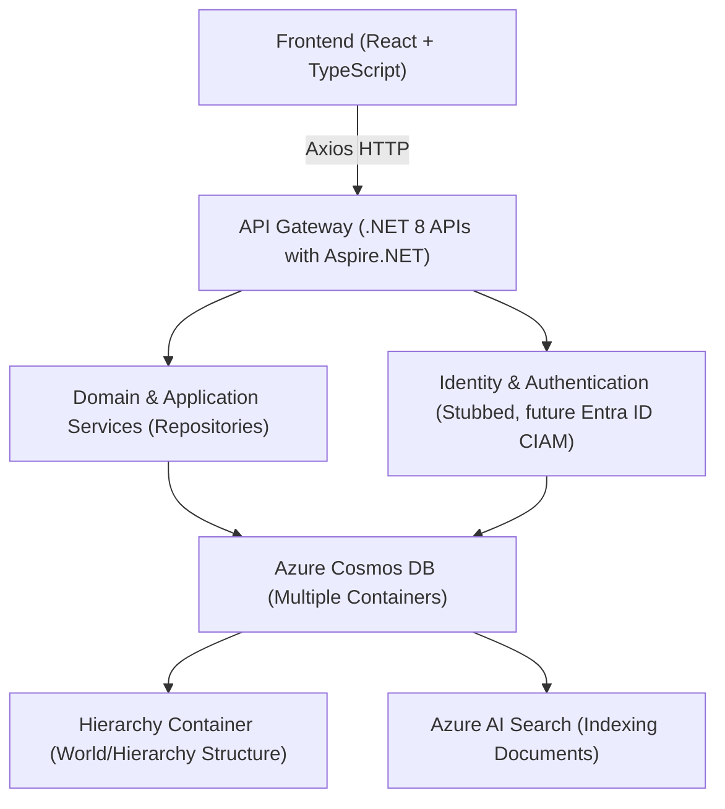
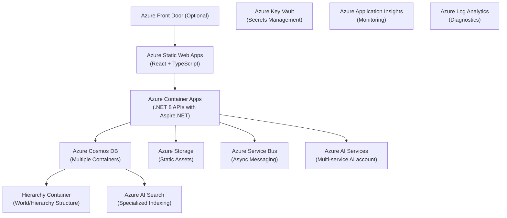

# Libris Maleficarum

**Libris Maleficarum** (Latin for "Book of Witchcraft") is an AI-enhanced campaign management and narrative tool designed for tabletop RPGs. While it's currently aimed at providing campaign, session, and character management, its flexible design and architecture will allow it to evolve into a general TTRPG assistant platform.

---

## Overview

Libris Maleficarum is built with modern, scalable technologies:

- A **.NET 8** backend using **Aspire** for cloud-native application composition, orchestration, and developer productivity.
- **Entity Framework Core** (Cosmos DB provider) alongside the **Repository Pattern** for data access.
- Azure Cosmos DB using multiple containers to support flexible, hierarchical, and extensible data structures.
- A **React** + **TypeScript** frontend that communicates with the backend via RESTful APIs.
- A stubbed identity service for future multi-user support and eventual integration with Entra ID CIAM.

---

## Architecture Overview

### High-Level Components

- **Backend (.NET 8 with Aspire.NET):**
  - API endpoints and business logic.
  - Entity Framework Core for Cosmos DB access.
  - Repository layer abstracting data operations.
  - Stubbed identity (via `IUserContextService`) to handle multi-user scenarios.

- **Frontend (React + TypeScript):**
  - Modern, responsive UI.
  - Communication with the backend using Axios.
  - Future integration with MSAL.js for authentication.

- **Data Storage (Azure Cosmos DB):**
  - Multiple containers to support hierarchical and flexible document structures.
  - Core entity is "World" at the root. Each "World" can contain nested documents (e.g., "Continent", "Country", etc.).
  - A dedicated container maintains the hierarchical structure of documents within each world.
  - Documents are indexed by Azure AI Search for advanced querying and semantic search.

- **Future Enhancements:**
  - Integration with Entra ID CIAM for secure, multi-user authentication.
  - Expansion of AI features to support dynamic narrative generation and analytics.

### High-Level Architecture Diagram



---

## Technology Stack

- **Backend:**
  - **.NET 8** & **Aspire.NET**
  - **Entity Framework Core** (Cosmos DB provider)
  - **Repository Pattern**
  - **IUserContextService** (stubbed; replace with Entra ID CIAM integration later)

- **Frontend:**
  - **React** with **TypeScript** (Create React App)
  - **Axios** for HTTP communication
  - Optionally **React Router** for multi-page interface

- **Data Storage:**
  - **Azure Cosmos DB** using multiple containers for hierarchical, flexible entity storage and a dedicated container for document hierarchy.

- **Deployment & DevOps:**
  - Local development using the Cosmos DB Emulator
  - Dockerization for cloud deployment (Azure App Service or AKS)
  - CI/CD via GitHub Actions or Azure DevOps

---

## Data Model & Cosmos DB Design

All TTRPG-related entities are stored in Azure Cosmos DB using a flexible, hierarchical model.

### Document Structure

- **World**: The root entity for all campaign data. Each world can contain many nested document types.
- **Nested Documents**: Examples include "Continent", "Country", "Region", "City", "Character", etc. These can be arbitrarily nested to support complex world-building.
- **Hierarchy Container**: A dedicated container maintains the parent-child relationships and hierarchy of documents within each world.
- **Indexing**: All documents are indexed by Azure AI Search for advanced semantic and full-text search.

#### Example: World and Nested Documents

```json
// World document
{
  "id": "world-001",
  "UserId": "user-abc",
  "Name": "Eldoria",
  "EntityType": "World",
  "CreatedDate": "2024-06-01T10:00:00Z"
}

// Continent document (child of World)
{
  "id": "continent-001",
  "WorldId": "world-001",
  "ParentId": "world-001",
  "Name": "Arcanis",
  "EntityType": "Continent"
}

// Country document (child of Continent)
{
  "id": "country-001",
  "WorldId": "world-001",
  "ParentId": "continent-001",
  "Name": "Valoria",
  "EntityType": "Country"
}
```

- Each document includes a reference to its parent (`ParentId`) and the root world (`WorldId`).
- The hierarchy container enables efficient traversal and management of nested structures.

---

## Azure Architecture

Libris Maleficarum leverages Azure cloud services for scalability, security, and extensibility:

- **Frontend Hosting:**
  - **Azure Static Web Apps** for hosting the React + TypeScript frontend.
  - Optionally, **Azure Front Door** for global CDN, SSL termination, and enhanced security.

- **Backend APIs:**
  - **Azure Container Apps (ACA)** hosting .NET 8 APIs (Aspire.NET).
  - All backend communications routed through ACA-hosted APIs.

- **Data Storage:**
  - **Azure Cosmos DB** (multiple containers for hierarchical world/entity storage and hierarchy management).
  - **Azure Storage (Blob Storage)** for static assets (images, documents, etc.).

- **AI & Search Services:**
  - **Azure AI Search** for specialized indexing (e.g., embeddings, semantic search).
  - **Azure AI Services (multi-service account)** for AI-driven features (e.g., narrative generation, analytics).

- **Messaging & Eventing:**
  - **Azure Service Bus** for asynchronous messaging and event-driven communication between backend components.

- **Security & Secrets Management:**
  - **Azure Key Vault** for secure storage and management of secrets and configuration.

- **Monitoring & Observability:**
  - **Azure Application Insights** and **Log Analytics** for monitoring, logging, and diagnostics.

- **Networking & Security (Optional):**
  - **Azure Front Door** as a global entry point providing CDN, SSL termination, and enhanced security.

All backend communications from the frontend and external services are routed exclusively through the API layer hosted in Azure Container Apps, ensuring a secure and consistent interface.

### Azure Architecture Diagram



### Infrastructure as Code (IaC)

Infrastructure resources will be provisioned and managed using **Bicep** templates stored in the `infra` folder of the repository. These templates define all Azure resources, ensuring consistent, repeatable, and version-controlled deployments.

- **Bicep Templates Location:** `infra/`
- **Deployment:** Automated via GitHub Actions workflows stored in the `.github` folder.
- **Secrets Management:** Secrets and sensitive configuration values securely managed via **Azure Key Vault**.
- **Monitoring & Observability:** Integrated with **Azure Application Insights** and **Log Analytics** for comprehensive monitoring and diagnostics.

## CI/CD Strategy

Continuous Integration and Continuous Deployment (CI/CD) will be implemented using **GitHub Actions**, stored in the `.github` folder:

- **Build & Test:** Automated builds, unit tests, linting, and security scans.
- **Deployment:** Automated deployments to Azure Static Web Apps (frontend) and Azure Container Apps (backend APIs).
- **Infrastructure Deployment:** Automated deployment of Azure resources using Bicep templates.
- **Secrets Management:** Securely managed via Azure Key Vault integration.
- **Monitoring & Logging:** Integrated with Azure Application Insights and Log Analytics for operational visibility.

## Folder Structure

The repository is organized for clarity, scalability, and best practices for both .NET 8 backend and React/TypeScript frontend development.

```text
/
├── .devcontainer/           # GitHub Codespaces/dev container config
├── .github/                 # GitHub Actions workflows and community files
├── infra/                   # Infrastructure as Code (Bicep templates, deployment scripts)
├── backend/                 # .NET 8 backend solution
│   ├── src/                         # All backend projects and solution
│   │   ├── LibrisMaleficarum.sln            # Solution file
│   │   ├── Api/                            # ASP.NET Core minimal API project
│   │   │   └── LibrisMaleficarum.Api.csproj
│   │   ├── Application/                    # Application layer (CQRS, services, DTOs)
│   │   │   └── LibrisMaleficarum.Application.csproj
│   │   ├── Domain/                         # Domain entities, value objects, interfaces
│   │   │   └── LibrisMaleficarum.Domain.csproj
│   │   ├── Infrastructure/                 # EF Core, Cosmos DB, repository implementations
│   │   │   └── LibrisMaleficarum.Infrastructure.csproj
│   │   └── tests/                          # Backend unit/integration tests
│   │       ├── LibrisMaleficarum.Api.Tests/
│   │       ├── LibrisMaleficarum.Application.Tests/
│   │       ├── LibrisMaleficarum.Domain.Tests/
│   │       └── LibrisMaleficarum.Infrastructure.Tests/
├── frontend/                # React + TypeScript frontend app
│   ├── src/                 # Source code (components, hooks, services, types, etc.)
│   │   ├── components/
│   │   ├── hooks/
│   │   ├── services/
│   │   ├── types/
│   │   ├── App.tsx
│   │   └── index.tsx
│   ├── public/              # Static assets (index.html, images, etc.)
│   ├── tests/               # Frontend unit/integration tests
│   ├── package.json
│   ├── tsconfig.json
│   └── ...                  # Other config files (vite.config.ts, .env, etc.)
├── README.md                # Project overview and getting started
├── DESIGN.md                # Architecture and design documentation
└── ...                      # Solution-level files, .editorconfig, etc.
```

### Key Points

- **Backend** follows Clean/Hexagonal Architecture, with all projects and the solution file under `backend/src/`.
- **Backend tests** are in `backend/src/tests/` and mirror the main project structure.
- **Frontend** is in `frontend/` and follows React/TypeScript best practices: `src/components`, `src/hooks`, `src/services`, `src/types`, etc.
- **Frontend tests** are in `frontend/tests/`.
- **Infrastructure as Code** is in `infra/`.
- **Codespaces/devcontainer config** is in `.devcontainer/`.
- **CI/CD and GitHub workflows** are in `.github/`.

This structure supports modularity, testability, and maintainability for both backend and frontend codebases.

## Automated Test Approaches

A comprehensive automated testing strategy is essential for ensuring code quality, maintainability, and reliability across both frontend and backend.

### Frontend (React + TypeScript)

- **Unit Testing:**  
  Use [Jest](https://jestjs.io/) as the primary test runner and assertion library for unit tests.  
  [React Testing Library](https://testing-library.com/docs/react-testing-library/intro/) is used for testing React components in a way that simulates user interaction and focuses on behavior over implementation details.

- **Component Testing:**  
  Write focused tests for each React component, using mocks and stubs for dependencies.  
  Use [React Testing Library](https://testing-library.com/docs/react-testing-library/intro/) to test component rendering, props, events, and state changes.

- **Integration Testing:**  
  Test the integration of multiple components and services, including API calls (mocked using [msw](https://mswjs.io/)).

- **End-to-End (E2E) Testing:**  
  Optionally, use [Cypress](https://www.cypress.io/) for E2E tests to simulate real user workflows in the browser.

### Backend (.NET 8, Aspire.NET, EF Core)

- **Unit Testing:**  
  Use [xUnit](https://xunit.net/) for unit tests of application and domain logic.  
  Mock dependencies using [Moq](https://github.com/moq/moq4).  
  Use [FluentAssertions](https://fluentassertions.com/) for expressive assertions.

- **Component/Integration Testing:**  
  Write integration tests for repository implementations, service classes, and API endpoints.  
  Use [TestServer](https://learn.microsoft.com/en-us/dotnet/api/microsoft.aspnetcore.testhost.testserver) from ASP.NET Core for in-memory API/component testing.  
  Use [Respawn](https://github.com/jbogard/Respawn) or similar tools to reset database state between tests.

- **API Testing:**  
  Test API endpoints using [xUnit](https://xunit.net/) and [FluentAssertions](https://fluentassertions.com/) for expressive assertions.  
  Use [WebApplicationFactory](https://learn.microsoft.com/en-us/dotnet/api/microsoft.aspnetcore.mvc.testing.webapplicationfactory-1) for end-to-end API tests.

- **Test Data:**  
  Use builders or test data factories to create domain objects for tests, ensuring clarity and maintainability.

### General Strategies

- **Arrange-Act-Assert (AAA) Pattern:**  
  Structure all tests using the AAA pattern for clarity.

- **Continuous Integration:**  
  All tests are run automatically in CI pipelines (GitHub Actions) on pull requests and merges.

- **Code Coverage:**  
  Monitor code coverage for both frontend and backend, aiming for high coverage on critical logic.

- **Test Organization:**  
  - Frontend tests are located in `frontend/tests/` or colocated with components as `*.test.tsx`.
  - Backend tests are in `backend/src/tests/`, mirroring the main project structure.

### Summary of Testing Frameworks and Libraries

| Layer     | Frameworks/Libraries                | Test Types                |
|-----------|-------------------------------------|---------------------------|
| Frontend  | Jest, React Testing Library, Cypress| Unit, Component, E2E      |
| Backend   | xUnit, Moq, FluentAssertions, TestServer | Unit, Integration, API   |
