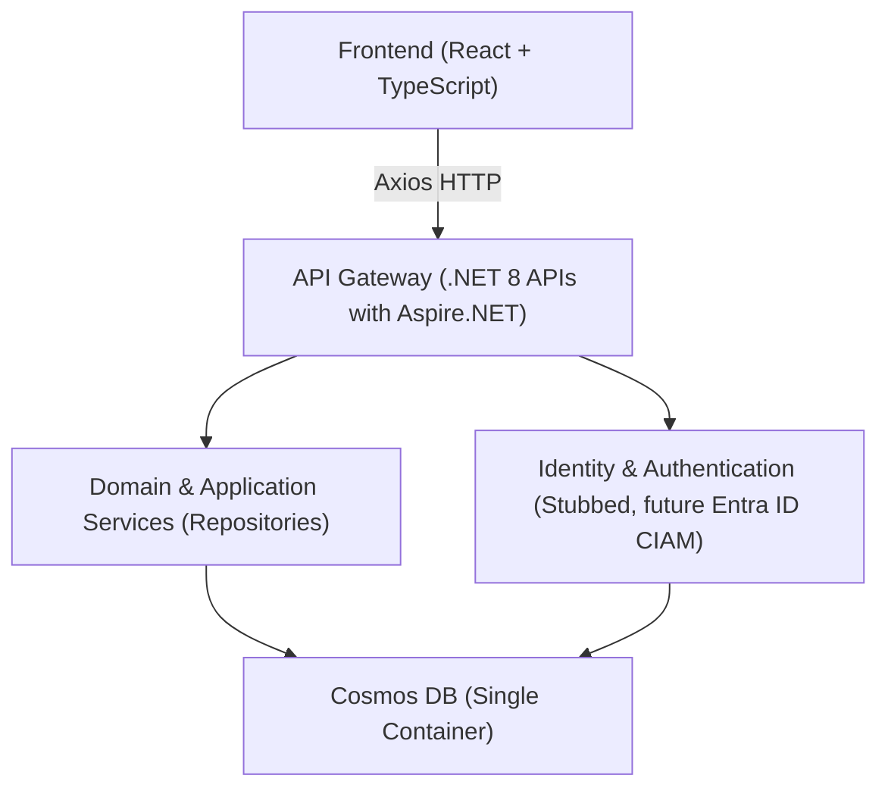
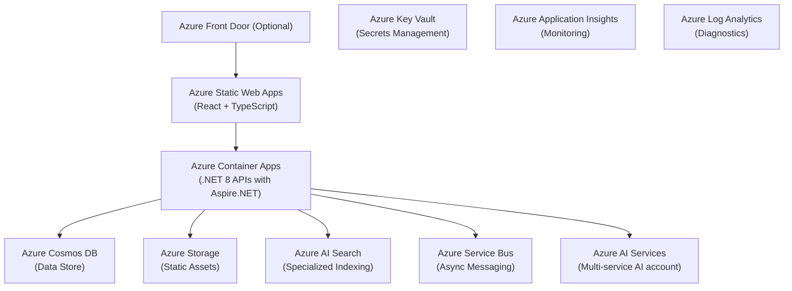

# Libris Maleficarum

**Libris Maleficarum** (Latin for "Book of Witchcraft") is an AI-enhanced campaign management and narrative tool designed for tabletop RPGs. While it's currently aimed at providing campaign, session, and character management, its flexible design and architecutre will allow it to evolve into a general TTRPG assistant platform.

---

## Overview

Libris Maleficarum is built with modern, scalable technologies:

- A **.NET 8** backend using **Aspire.NET** for lightweight API scaffolding.
- **Entity Framework Core** (Cosmos DB provider) alongside the **Repository Pattern** for data access.
- A single Azure Cosmos DB container employing a composite partition key approach (using synthetic properties if necessary).
- A **React** + **TypeScript** frontend that communicates with the backend via RESTful APIs.
- A stubbed identity service for future multi-user support and eventual integration with Entra ID CIAM.

---

## Architecture Overview

### High-Level Components

- **Backend (.NET 8 with Aspire.NET):**
  - API endpoints and business logic.
  - Entity Framework Core for Cosmos DB access.
  - Repository layer abstracting data operations.
  - Stubbed identity (via `IUserContextService`) to handle multi-user scenarios.

- **Frontend (React + TypeScript):**
  - Modern, responsive UI.
  - Communication with the backend using Axios.
  - Future integration with MSAL.js for authentication.

- **Data Storage (Azure Cosmos DB):**
  - A single container ("LibrisMaleficarumContainer") that stores all entities.
  - Composite partition key defined by the properties `UserId` and `CampaignId` (or a synthetic property combining them).
  - Documents include a common `EntityType` field for type discrimination (e.g., "Campaign", "Session", etc.).

- **Future Enhancements:**
  - Integration with Entra ID CIAM for secure, multi-user authentication.
  - Expansion of AI features to support dynamic narrative generation and analytics.

### High-Level Architecture Diagram



---

## Technology Stack

- **Backend:**
  - **.NET 8** & **Aspire.NET**
  - **Entity Framework Core** (Cosmos DB provider)
  - **Repository Pattern**
  - **IUserContextService** (stubbed; replace with Entra ID CIAM integration later)

- **Frontend:**
  - **React** with **TypeScript** (Create React App)
  - **Axios** for HTTP communication
  - Optionally **React Router** for multi-page interface

- **Data Storage:**
  - **Azure Cosmos DB** using a single container and composite partition key strategy

- **Deployment & DevOps:**
  - Local development using the Cosmos DB Emulator
  - Dockerization for cloud deployment (Azure App Service or AKS)
  - CI/CD via GitHub Actions or Azure DevOps

---

## Data Model & Cosmos DB Design

All TTRPG-related entities are stored in one container.

### Document Structure

Each document includes:

- `id`: Unique document identifier.
- `UserId`: Identifies the owner (supports multi-user capabilities).
- `CampaignId`: For campaign documents, this is the same as the campaign's `id`. For sub-entities like Sessions, Characters, and Events, this references the parent campaign.
- `EntityType`: Type discriminator (e.g., "Campaign", "Session", "Character", "Event").
- *(Optionally)* `PartitionKey`: A synthetic property combining `UserId` and `CampaignId` (e.g., `"{UserId}:{CampaignId}"`) if needed.

### Example: Campaign Document

```json
{
  "id": "campaign-123",
  "UserId": "user-abc",
  "CampaignId": "campaign-123",
  "EntityType": "Campaign",
  "Name": "The Dark Coven",
  "Description": "A campaign of intrigue and forbidden magic.",
  "CreatedDate": "2023-10-05T10:23:00Z"
}
```

## Azure Architecture

Libris Maleficarum leverages Azure cloud services for scalability, security, and extensibility:

- **Frontend Hosting:**
  - **Azure Static Web Apps** for hosting the React + TypeScript frontend.
  - Optionally, **Azure Front Door** for global CDN, SSL termination, and enhanced security.

- **Backend APIs:**
  - **Azure Container Apps (ACA)** hosting .NET 8 APIs (Aspire.NET).
  - All backend communications routed through ACA-hosted APIs.

- **Data Storage:**
  - **Azure Cosmos DB** (single container with composite partition keys: `UserId` + `CampaignId`).
  - **Azure Storage (Blob Storage)** for static assets (images, documents, etc.).

- **AI & Search Services:**
  - **Azure AI Search** for specialized indexing (e.g., embeddings).
  - **Azure AI Services (multi-service account)** for AI-driven features (e.g., narrative generation, analytics).

- **Messaging & Eventing:**
  - **Azure Service Bus** for asynchronous messaging and event-driven communication between backend components. This enables decoupled, scalable, and reliable message handling for background tasks and event-driven workflows.

- **Security & Secrets Management:**
  - **Azure Key Vault** for secure storage and management of secrets and configuration.

- **Monitoring & Observability:**
  - **Azure Application Insights** and **Log Analytics** for monitoring, logging, and diagnostics.

- **Networking & Security (Optional):**
  - **Azure Front Door** as a global entry point providing CDN, SSL termination, and enhanced security.

All backend communications from the frontend and external services are routed exclusively through the API layer hosted in Azure Container Apps, ensuring a secure and consistent interface.

### Azure Architecture Diagram



### Infrastructure as Code (IaC)

Infrastructure resources will be provisioned and managed using **Bicep** templates stored in the `infra` folder of the repository. These templates define all Azure resources, ensuring consistent, repeatable, and version-controlled deployments.

- **Bicep Templates Location:** `infra/`
- **Deployment:** Automated via GitHub Actions workflows stored in the `.github` folder.
- **Secrets Management:** Secrets and sensitive configuration values securely managed via **Azure Key Vault**.
- **Monitoring & Observability:** Integrated with **Azure Application Insights** and **Log Analytics** for comprehensive monitoring and diagnostics.

## CI/CD Strategy

Continuous Integration and Continuous Deployment (CI/CD) will be implemented using **GitHub Actions**, stored in the `.github` folder:

- **Build & Test:** Automated builds, unit tests, linting, and security scans.
- **Deployment:** Automated deployments to Azure Static Web Apps (frontend) and Azure Container Apps (backend APIs).
- **Infrastructure Deployment:** Automated deployment of Azure resources using Bicep templates.
- **Secrets Management:** Securely managed via Azure Key Vault integration.
- **Monitoring & Logging:** Integrated with Azure Application Insights and Log Analytics for operational visibility.

## Folder Structure

The repository is organized for clarity, scalability, and best practices for both .NET 8 backend and React/TypeScript frontend development.

```text
/
├── .devcontainer/           # GitHub Codespaces/dev container config
├── .github/                 # GitHub Actions workflows and community files
├── infra/                   # Infrastructure as Code (Bicep templates, deployment scripts)
├── backend/                 # .NET 8 backend solution
│   ├── src/                         # All backend projects and solution
│   │   ├── LibrisMaleficarum.sln            # Solution file
│   │   ├── Api/                            # ASP.NET Core minimal API project
│   │   │   └── LibrisMaleficarum.Api.csproj
│   │   ├── Application/                    # Application layer (CQRS, services, DTOs)
│   │   │   └── LibrisMaleficarum.Application.csproj
│   │   ├── Domain/                         # Domain entities, value objects, interfaces
│   │   │   └── LibrisMaleficarum.Domain.csproj
│   │   ├── Infrastructure/                 # EF Core, Cosmos DB, repository implementations
│   │   │   └── LibrisMaleficarum.Infrastructure.csproj
│   │   └── tests/                          # Backend unit/integration tests
│   │       ├── LibrisMaleficarum.Api.Tests/
│   │       ├── LibrisMaleficarum.Application.Tests/
│   │       ├── LibrisMaleficarum.Domain.Tests/
│   │       └── LibrisMaleficarum.Infrastructure.Tests/
├── frontend/                # React + TypeScript frontend app
│   ├── src/                 # Source code (components, hooks, services, types, etc.)
│   │   ├── components/
│   │   ├── hooks/
│   │   ├── services/
│   │   ├── types/
│   │   ├── App.tsx
│   │   └── index.tsx
│   ├── public/              # Static assets (index.html, images, etc.)
│   ├── tests/               # Frontend unit/integration tests
│   ├── package.json
│   ├── tsconfig.json
│   └── ...                  # Other config files (vite.config.ts, .env, etc.)
├── README.md                # Project overview and getting started
├── DESIGN.md                # Architecture and design documentation
└── ...                      # Solution-level files, .editorconfig, etc.
```

### Key Points

- **Backend** follows Clean/Hexagonal Architecture, with all projects and the solution file under `backend/src/`.
- **Backend tests** are in `backend/src/tests/` and mirror the main project structure.
- **Frontend** is in `frontend/` and follows React/TypeScript best practices: `src/components`, `src/hooks`, `src/services`, `src/types`, etc.
- **Frontend tests** are in `frontend/tests/`.
- **Infrastructure as Code** is in `infra/`.
- **Codespaces/devcontainer config** is in `.devcontainer/`.
- **CI/CD and GitHub workflows** are in `.github/`.

This structure supports modularity, testability, and maintainability for both backend and frontend codebases.
