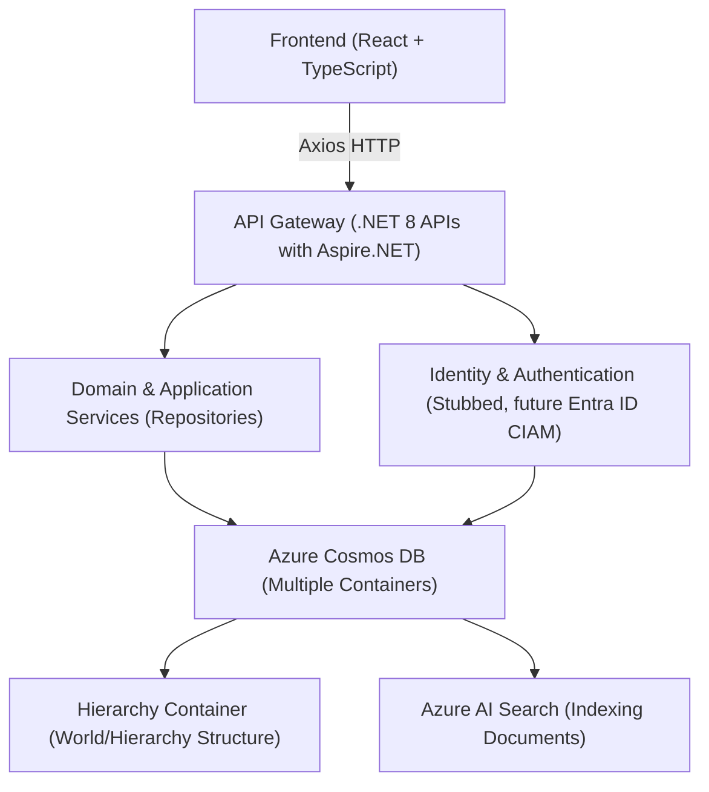

# Architecture Overview

## High-Level Components

- **Backend (.NET 8 with Aspire.NET):**
  - API endpoints and business logic.
  - Entity Framework Core for Cosmos DB access.
  - Repository layer abstracting data operations.
  - Stubbed identity (via `IUserContextService`) to handle multi-user scenarios.

- **Frontend (React + TypeScript):**
  - Modern, responsive UI.
  - Communication with the backend using Axios.
  - Future integration with MSAL.js for authentication.

- **Data Storage (Azure Cosmos DB):**
  - Multiple containers to support hierarchical and flexible document structures.
  - Core entity is "World" at the root. Each "World" can contain nested documents (e.g., "Continent", "Country", etc.).
  - A dedicated container maintains the hierarchical structure of documents within each world.
  - Documents are indexed by Azure AI Search for advanced querying and semantic search.

- **Future Enhancements:**
  - Integration with Entra ID CIAM for secure, multi-user authentication.
  - Expansion of AI features to support dynamic narrative generation and analytics.

## High-Level Architecture Diagram

