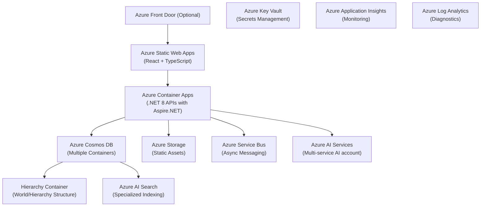

# Azure Infrastructure

Libris Maleficarum leverages Azure cloud services for scalability, security, and extensibility.

- **Frontend Hosting:** Azure Static Web Apps, optionally Azure Front Door.
- **Backend APIs:** Azure Container Apps (ACA) hosting .NET 8 APIs (Aspire.NET).
- **Data Storage:** Azure Cosmos DB (multiple containers), Azure Storage (Blob Storage).
- **AI & Search Services:** Azure AI Search, Azure AI Services.
- **Messaging & Eventing:** Azure Service Bus.
- **Security & Secrets Management:** Azure Key Vault.
- **Monitoring & Observability:** Azure Application Insights, Log Analytics.

All backend communications from the frontend and external services are routed exclusively through the API layer hosted in Azure Container Apps.

## Azure Architecture Diagram

## Infrastructure as Code (IaC)

- **Bicep Templates Location:** `infra/`
- **Deployment:** Automated via GitHub Actions workflows stored in the `.github` folder.
- **Secrets Management:** Secrets and sensitive configuration values securely managed via **Azure Key Vault**.
- **Monitoring & Observability:** Integrated with **Azure Application Insights** and **Log Analytics** for comprehensive monitoring and diagnostics.
