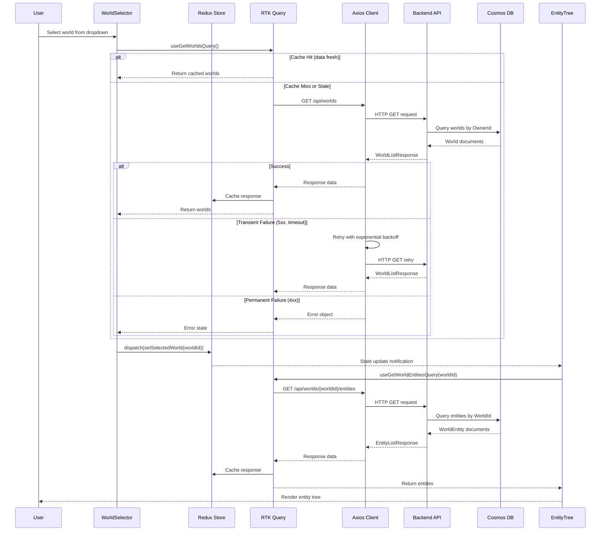

## Libris Maleficarum Frontend Application Documentation

A modern, accessible React 19 Single Page Application (SPA) for TTRPG world-building and campaign management. Built with TypeScript, Redux Toolkit, TailwindCSS, and Shadcn/ui components, this application provides game masters and players with a rich, fantasy-themed interface for creating and managing complex campaign worlds.

## 1. Component Overview

### Purpose/Responsibility

- **OVR-001**: Primary responsibility is to provide a modern, accessible web-based user interface for the Libris Maleficarum TTRPG campaign management platform
- **OVR-002**: Scope includes:
  - ✅ Hierarchical world/entity navigation and visualization
  - ✅ CRUD operations for worlds, entities, campaigns, and assets
  - ✅ Real-time AI-powered chat and content generation interface (future)
  - ✅ Responsive, accessible UI components following WCAG 2.2 Level AA standards
  - ✅ Dark fantasy-themed visual design with optional light "parchment" theme
  - ❌ Backend API implementation (handled by libris-maleficarum-service)
  - ❌ Data persistence and business logic (delegated to backend)
  - ❌ Authentication and authorization (stubbed; future integration with Entra ID CIAM)
- **OVR-003**: System context and relationships:
  - **Frontend SPA**: Interacts with backend REST API for all data operations
  - **Backend Service**: .NET 10 + Aspire.NET service with Clean/Hexagonal architecture (future implementation)
  - **Data Storage**: Azure Cosmos DB via backend API (hierarchical WorldEntity model)
  - **AI Integration**: CopilotKit client for AG-UI protocol communication with Microsoft Agent Framework backend (future)
  - **Asset Storage**: Azure Blob Storage via backend API endpoints
  - **Development Stack**: Vite dev server, Vitest for testing, Redux Toolkit for state management

## 2. Architecture Section

### Design Patterns

- **ARC-001**: Design patterns used:
  - **Component Composition Pattern**: Functional React components with hooks for reusable, testable UI logic
  - **Container/Presentational Pattern**: Components separated into smart containers (Redux-connected) and presentational components (pure UI)
  - **Redux Flux Pattern**: Unidirectional data flow with Redux Toolkit slices managing application state
  - **Repository Pattern (API Layer)**: RTK Query endpoints abstract backend API interactions with automatic caching
  - **Observer Pattern**: Redux subscriptions and React context for reactive state updates
  - **Singleton Pattern**: Single Redux store instance for centralized state management
  - **Factory Pattern**: Component factory via Shadcn/ui for consistent UI component generation
  - **Module Pattern**: TypeScript modules with path aliases (`@/`) for clean imports

### Dependencies

- **ARC-002**: Internal and external dependencies:

#### Core Framework Dependencies

| Dependency | Version | Purpose |
|------------|---------|---------|
| `react` | ^19.2.0 | Core UI framework for component-based architecture |
| `react-dom` | ^19.2.0 | DOM rendering and reconciliation |
| `typescript` | ~5.9.3 | Type safety, IDE support, compile-time validation |
| `vite` | ^7.3.1 | Build tool and dev server with HMR |

#### State Management Dependencies

| Dependency | Version | Purpose |
|------------|---------|---------|
| `@reduxjs/toolkit` | ^2.11.2 | State management with Redux slices and RTK Query |
| `react-redux` | ^9.2.0 | React bindings for Redux (hooks: useSelector, useDispatch) |

#### UI Component Dependencies

| Dependency | Version | Purpose |
|------------|---------|---------|
| `@radix-ui/react-*` | ^1.x-^2.x | Headless UI primitives (Dialog, Select, ScrollArea, ContextMenu, etc.) |
| `lucide-react` | ^0.562.0 | Icon library for consistent visual elements |
| `tailwindcss` | ^4.1.18 | Utility-first CSS framework for styling |
| `@tailwindcss/vite` | ^4.1.18 | Vite plugin for TailwindCSS v4 |
| `class-variance-authority` | ^0.7.1 | Type-safe variant styling for components |
| `clsx` | ^2.1.1 | Conditional class name composition |
| `tailwind-merge` | ^3.4.0 | Intelligent merging of Tailwind classes |

#### API Client Dependencies

| Dependency | Version | Purpose |
|------------|---------|---------|
| `axios` | ^1.13.2 | HTTP client for REST API communication |
| `axios-retry` | ^4.5.0 | Automatic retry with exponential backoff for transient failures |

#### Testing Dependencies

| Dependency | Version | Purpose |
|------------|---------|---------|
| `vitest` | ^4.0.17 | Fast unit test runner with Vite integration |
| `@testing-library/react` | ^16.3.1 | React component testing utilities |
| `@testing-library/jest-dom` | ^6.9.1 | Custom Jest matchers for DOM assertions |
| `@testing-library/user-event` | ^14.6.1 | User interaction simulation for tests |
| `jest-axe` | ^10.0.0 | Accessibility testing assertions (WCAG compliance) |
| `jsdom` | ^27.4.0 | DOM environment for headless testing |
| `msw` | ^2.12.7 | Mock Service Worker for API mocking in tests |
| `@vitest/coverage-v8` | ^4.0.16 | Code coverage reporting with V8 engine |

#### Development Dependencies

| Dependency | Version | Purpose |
|------------|---------|---------|
| `eslint` | ^9.39.1 | Code quality and style enforcement |
| `typescript-eslint` | ^8.53.0 | TypeScript-specific ESLint rules |
| `prettier` | (via scripts) | Code formatting for consistency |
| `@vitejs/plugin-react` | ^5.1.1 | React Fast Refresh and JSX transform for Vite |

### Component Interactions and Relationships

- **ARC-003**: Component interactions:
  - **App.tsx** → Root component orchestrating layout structure (TopToolbar, WorldSidebar, SidePanel, MainPanel, ChatWindow)
  - **WorldSidebar** → Container component managing world selection and entity tree navigation via Redux state
  - **TopToolbar** → Global navigation and user actions (future: search, notifications, user profile)
  - **MainPanel** → Content workspace responding to selected world/entity from Redux state
  - **ChatWindow** → AI assistant interface (future: CopilotKit integration)
  - **Redux Store** → Centralized state management with slices:
    - `sidePanel`: Collapse/expand state for SidePanel
    - `worldSidebar`: Selected world/entity, expanded tree nodes, modal states
    - `api`: RTK Query cache and loading states for API data
  - **API Services** → RTK Query endpoints for backend communication:
    - `worldApi`: CRUD operations for World entities
    - `worldEntityApi`: CRUD operations for WorldEntity hierarchy (future)
    - `api`: Base configuration with axios-based query function
  - **UI Components** → Shadcn/ui components built on Radix UI primitives (Button, Card, Dialog, Input, Select, etc.)

### Visual Diagrams

- **ARC-004**: UML class, sequence, and component diagrams

#### Component Structure and Dependencies Diagram

- **ARC-005**: Comprehensive mermaid diagram showing component structure, relationships, and dependencies

```mermaid
graph TB
    subgraph "Frontend Application (libris-maleficarum-app)"
        subgraph "React Component Tree"
            App[App.tsx<br/>Root Layout Component]
            TopToolbar[TopToolbar<br/>Global Navigation]
            WorldSidebar[WorldSidebar<br/>World/Entity Navigation]
            SidePanel[SidePanel<br/>Collapsible Panel]
            MainPanel[MainPanel<br/>Content Workspace]
            ChatWindow[ChatWindow<br/>AI Assistant Future]
            
            WorldSelector[WorldSelector<br/>World Dropdown]
            EntityTree[EntityTree<br/>Lazy-Loaded Tree]
            EntityTreeNode[EntityTreeNode<br/>Tree Node Component]
            EmptyState[EmptyState<br/>No Selection UI]
            WorldFormModal[WorldFormModal<br/>Create/Edit Form]
        end
        
        subgraph "Redux Store (State Management)"
            Store[Redux Store<br/>store.ts]
            SidePanelSlice[sidePanelSlice<br/>Expand/Collapse State]
            WorldSidebarSlice[worldSidebarSlice<br/>Selection & Tree State]
            ApiSlice[api RTK Query Reducer<br/>Cache & Loading States]
        end
        
        subgraph "API Layer (RTK Query)"
            BaseApi[api.ts<br/>Base RTK Query Config]
            WorldApi[worldApi.ts<br/>World CRUD Endpoints]
            WorldEntityApi[worldEntityApi.ts<br/>Entity CRUD Future]
            ApiClient[apiClient.ts<br/>Axios with Retry Logic]
        end
        
        subgraph "UI Component Library"
            ShadcnComponents[Shadcn/ui Components<br/>Button, Card, Dialog, etc.]
            RadixPrimitives[Radix UI Primitives<br/>Headless Components]
            LucideIcons[Lucide Icons<br/>Icon Library]
        end
        
        subgraph "Utilities"
            Utils[utils.ts<br/>Helper Functions]
            SessionCache[sessionCache.ts<br/>Session Storage Cache]
            EntityIcons[entityIcons.ts<br/>Entity Type Icons]
        end
    end
    
    subgraph "External Services"
        BackendAPI[Backend REST API<br/>.NET 10 + Aspire.NET<br/>Future Implementation]
        CosmosDB[Azure Cosmos DB<br/>WorldEntity Hierarchy]
        BlobStorage[Azure Blob Storage<br/>Asset Storage]
        AzureAISearch[Azure AI Search<br/>Semantic Search<br/>Optional]
    end
    
    subgraph "Development Tools"
        Vite[Vite Dev Server<br/>HMR + Build Tool]
        Vitest[Vitest Test Runner<br/>Unit & Integration Tests]
        ESLint[ESLint<br/>Code Quality]
        TailwindCSS[TailwindCSS v4<br/>Utility-First Styling]
    end
    
    %% Component Tree Relationships
    App --> TopToolbar
    App --> WorldSidebar
    App --> SidePanel
    App --> MainPanel
    App --> ChatWindow
    
    WorldSidebar --> WorldSelector
    WorldSidebar --> EntityTree
    WorldSidebar --> WorldFormModal
    EntityTree --> EntityTreeNode
    EntityTree --> EmptyState
    
    %% Component to Redux Connections
    App -.uses.-> Store
    WorldSidebar -.uses.-> Store
    SidePanel -.uses.-> Store
    WorldSelector -.uses.-> Store
    EntityTree -.uses.-> Store
    WorldFormModal -.uses.-> Store
    
    %% Redux Store Composition
    Store --> SidePanelSlice
    Store --> WorldSidebarSlice
    Store --> ApiSlice
    
    %% API Layer Composition
    ApiSlice --> BaseApi
    BaseApi --> WorldApi
    BaseApi --> WorldEntityApi
    WorldApi --> ApiClient
    WorldEntityApi --> ApiClient
    
    %% Component to API Connections
    WorldSelector -.queries.-> WorldApi
    EntityTree -.queries.-> WorldEntityApi
    WorldFormModal -.mutates.-> WorldApi
    
    %% UI Component Usage
    WorldSelector --> ShadcnComponents
    EntityTreeNode --> ShadcnComponents
    WorldFormModal --> ShadcnComponents
    ShadcnComponents --> RadixPrimitives
    EntityTreeNode --> LucideIcons
    
    %% Utility Usage
    EntityTreeNode --> EntityIcons
    WorldApi --> SessionCache
    
    %% External Service Connections
    ApiClient -->|HTTP/REST| BackendAPI
    BackendAPI -->|EF Core| CosmosDB
    BackendAPI -->|SDK| BlobStorage
    BackendAPI -->|Optional| AzureAISearch
    
    %% Development Tool Connections
    App -.dev server.-> Vite
    App -.tests.-> Vitest
    App -.linting.-> ESLint
    App -.styling.-> TailwindCSS
    
    classDef reactComponent fill:#61DAFB,stroke:#333,stroke-width:2px,color:#000
    classDef reduxComponent fill:#764ABC,stroke:#333,stroke-width:2px,color:#fff
    classDef apiComponent fill:#FF6B6B,stroke:#333,stroke-width:2px,color:#fff
    classDef uiComponent fill:#9D4EDD,stroke:#333,stroke-width:2px,color:#fff
    classDef utilComponent fill:#FCA311,stroke:#333,stroke-width:2px,color:#000
    classDef externalService fill:#06D6A0,stroke:#333,stroke-width:2px,color:#000
    classDef devTool fill:#4CC9F0,stroke:#333,stroke-width:2px,color:#000
    
    class App,TopToolbar,WorldSidebar,SidePanel,MainPanel,ChatWindow,WorldSelector,EntityTree,EntityTreeNode,EmptyState,WorldFormModal reactComponent
    class Store,SidePanelSlice,WorldSidebarSlice,ApiSlice reduxComponent
    class BaseApi,WorldApi,WorldEntityApi,ApiClient apiComponent
    class ShadcnComponents,RadixPrimitives,LucideIcons uiComponent
    class Utils,SessionCache,EntityIcons utilComponent
    class BackendAPI,CosmosDB,BlobStorage,AzureAISearch externalService
    class Vite,Vitest,ESLint,TailwindCSS devTool
```



#### Data Flow Sequence Diagram



## 3. Interface Documentation

### Public Interfaces and Usage Patterns

- **INT-001**: Public interfaces:
  - **React Components**: All components export named functions with TypeScript props interfaces
  - **Redux Store**: Single store instance exported from `src/store/store.ts`
  - **API Hooks**: Auto-generated RTK Query hooks for data fetching and mutations
  - **Type Definitions**: Shared TypeScript interfaces in `src/services/types/`

- **INT-002**: Method/Property Reference Table

#### Core Component Interfaces

| Component | Props | Purpose | Usage Notes |
|-----------|-------|---------|-------------|
| `App` | None | Root application component | Entry point for React tree; wrapped by Redux Provider |
| `WorldSidebar` | None | World/entity navigation container | Redux-connected; manages WorldSelector, EntityTree, modals |
| `WorldSelector` | None | World selection dropdown | Uses `useGetWorldsQuery()` hook; dispatches `setSelectedWorld()` |
| `EntityTree` | None | Lazy-loaded entity hierarchy tree | Uses `useSelector(selectSelectedWorldId)` for context |
| `WorldFormModal` | `isOpen: boolean`<br>`mode: 'create' \| 'edit'`<br>`world?: World`<br>`onClose: () => void` | Create/edit world modal | Controlled component; uses `useCreateWorldMutation()` or `useUpdateWorldMutation()` |
| `EntityTreeNode` | `entity: WorldEntity`<br>`depth: number`<br>`isExpanded: boolean`<br>`onToggle: () => void` | Single tree node component | Recursive component for hierarchy rendering |
| `EmptyState` | `message?: string`<br>`action?: ReactNode` | Empty state UI | Displays when no world or entities selected |

#### Redux Store Interfaces

| Slice | State Shape | Actions | Selectors |
|-------|-------------|---------|-----------|
| `sidePanel` | `{ isExpanded: boolean }` | `toggle()`, `setExpanded(boolean)` | N/A (direct state access) |
| `worldSidebar` | `{ selectedWorldId: string \| null, selectedEntityId: string \| null, expandedNodeIds: string[], isWorldFormOpen: boolean, editingWorldId: string \| null, ... }` | `setSelectedWorld(id)`, `setSelectedEntity(id)`, `toggleNodeExpanded(id)`, `openWorldFormCreate()`, `openWorldFormEdit(id)`, `closeWorldForm()`, ... | `selectSelectedWorldId`, `selectSelectedEntityId`, `selectExpandedNodeIds`, `selectIsWorldFormOpen`, `selectEditingWorldId`, ... |
| `api` (RTK Query) | `{ queries: {...}, mutations: {...} }` | Auto-generated by RTK Query | N/A (use hooks directly) |

#### RTK Query API Hooks

| Hook | Parameters | Return Type | Purpose |
|------|------------|-------------|---------|
| `useGetWorldsQuery()` | `void` | `{ data: World[], isLoading: boolean, error: unknown }` | Fetch all worlds owned by user |
| `useGetWorldByIdQuery(id)` | `id: string` | `{ data: World, isLoading: boolean, error: unknown }` | Fetch single world by ID |
| `useCreateWorldMutation()` | N/A | `[mutate: (request: CreateWorldRequest) => Promise<World>, { isLoading: boolean, error: unknown }]` | Create new world |
| `useUpdateWorldMutation()` | N/A | `[mutate: (args: { id: string, data: UpdateWorldRequest }) => Promise<World>, { isLoading: boolean, error: unknown }]` | Update existing world |
| `useDeleteWorldMutation()` | N/A | `[mutate: (id: string) => Promise<void>, { isLoading: boolean, error: unknown }]` | Soft delete world |

- **INT-003**: Events/Callbacks/Notification Mechanisms:
  - **Redux State Updates**: Components subscribe to state changes via `useSelector()` hooks
  - **RTK Query Cache Invalidation**: Automatic cache updates via tag-based invalidation (`providesTags`, `invalidatesTags`)
  - **User Events**: Standard React event handlers (`onClick`, `onChange`, etc.)
  - **Future**: SignalR real-time notifications for multi-user collaboration

## 4. Implementation Details

### Main Implementation Classes and Responsibilities

- **IMP-001**: Main implementation classes:

#### Component Layer

| Component/Module | File Path | Responsibility |
|------------------|-----------|----------------|
| `App` | `src/App.tsx` | Root component orchestrating layout structure |
| `TopToolbar` | `src/components/TopToolbar/TopToolbar.tsx` | Global navigation and user actions |
| `WorldSidebar` | `src/components/WorldSidebar/WorldSidebar.tsx` | Container for world selection and entity tree |
| `WorldSelector` | `src/components/WorldSidebar/WorldSelector.tsx` | World selection dropdown with CRUD actions |
| `EntityTree` | `src/components/WorldSidebar/EntityTree.tsx` | Lazy-loaded entity hierarchy tree |
| `EntityTreeNode` | `src/components/WorldSidebar/EntityTreeNode.tsx` | Recursive tree node component with expand/collapse |
| `WorldFormModal` | `src/components/WorldSidebar/WorldFormModal.tsx` | Create/edit world modal form |
| `EmptyState` | `src/components/WorldSidebar/EmptyState.tsx` | Empty state UI for no selection |
| `SidePanel` | `src/components/SidePanel/SidePanel.tsx` | Collapsible side panel (future content) |
| `MainPanel` | `src/components/MainPanel/MainPanel.tsx` | Main content workspace |
| `ChatWindow` | `src/components/ChatWindow/ChatWindow.tsx` | AI assistant interface (future CopilotKit) |

#### State Management Layer

| Module | File Path | Responsibility |
|--------|-----------|----------------|
| `store` | `src/store/store.ts` | Redux store configuration with slices and middleware |
| `sidePanelSlice` | `src/store/store.ts` (inline) | Side panel expand/collapse state |
| `worldSidebarSlice` | `src/store/worldSidebarSlice.ts` | World sidebar UI state (selection, tree, modals) |

#### API Layer

| Module | File Path | Responsibility |
|--------|-----------|----------------|
| `api` | `src/services/api.ts` | Base RTK Query configuration with axios-based query function |
| `worldApi` | `src/services/worldApi.ts` | World CRUD endpoints injected into base API |
| `worldEntityApi` | `src/services/worldEntityApi.ts` | WorldEntity CRUD endpoints (future implementation) |
| `apiClient` | `src/lib/apiClient.ts` | Axios instance with retry logic and error handling |

#### Utility Layer

| Module | File Path | Responsibility |
|--------|-----------|----------------|
| `utils` | `src/lib/utils.ts` | General utility functions (e.g., `cn()` for class merging) |
| `sessionCache` | `src/lib/sessionCache.ts` | Session storage abstraction for caching |
| `entityIcons` | `src/lib/entityIcons.ts` | Mapping of EntityType to Lucide icons |

#### UI Component Library

| Module | File Path | Responsibility |
|--------|-----------|----------------|
| `button` | `src/components/ui/button.tsx` | Shadcn/ui Button component (Radix UI primitive) |
| `card` | `src/components/ui/card.tsx` | Shadcn/ui Card component for content containers |
| `dialog` | `src/components/ui/dialog.tsx` | Shadcn/ui Dialog component for modals |
| `input` | `src/components/ui/input.tsx` | Shadcn/ui Input component for form fields |
| `select` | `src/components/ui/select.tsx` | Shadcn/ui Select component for dropdowns |
| `scroll-area` | `src/components/ui/scroll-area.tsx` | Shadcn/ui ScrollArea component for scrollable content |
| `separator` | `src/components/ui/separator.tsx` | Shadcn/ui Separator component for visual dividers |
| `textarea` | `src/components/ui/textarea.tsx` | Shadcn/ui Textarea component for multi-line input |
| `context-menu` | `src/components/ui/context-menu.tsx` | Shadcn/ui ContextMenu component for right-click menus |

### Configuration Requirements and Initialization

- **IMP-002**: Configuration and initialization:

#### Environment Variables

| Variable | Purpose | Default/Example |
|----------|---------|-----------------|
| `VITE_API_BASE_URL` | Backend API base URL (production) | `http://localhost:5000` |
| `APISERVICE_HTTPS` | Aspire-injected HTTPS URL (local dev) | Auto-injected by Aspire.NET |
| `APISERVICE_HTTP` | Aspire-injected HTTP URL (local dev fallback) | Auto-injected by Aspire.NET |

#### Vite Configuration

- **File**: `vite.config.ts`
- **Key Settings**:
  - React plugin with Fast Refresh
  - TailwindCSS v4 Vite plugin
  - Path aliases: `@/` → `./src/`
  - Dev server proxy: `/api` → backend service URL (auto-detects Aspire env vars or uses `VITE_API_BASE_URL`)
  - Build output: `dist/` directory

#### TypeScript Configuration

- **Files**: `tsconfig.json`, `tsconfig.app.json`, `tsconfig.node.json`
- **Key Settings**:
  - Target: ES2022
  - Module: ESNext
  - Strict mode enabled
  - Path aliases: `@/*` → `./src/*`
  - JSX: `react-jsx` (automatic runtime)

#### ESLint Configuration

- **File**: `eslint.config.js`
- **Key Settings**:
  - Flat config format (ESLint 9.x)
  - TypeScript ESLint parser
  - React Hooks plugin for Rules of Hooks enforcement
  - React Refresh plugin for Fast Refresh compatibility

#### Vitest Configuration

- **File**: `vitest.config.ts`
- **Key Settings**:
  - Test environment: jsdom (DOM simulation)
  - Globals enabled for Vitest API
  - Setup file: `vitest.setup.ts` (imports jest-axe, jest-dom, MSW handlers)
  - CSS processing enabled

#### TailwindCSS Configuration

- **File**: `@tailwind/vite` plugin (TailwindCSS v4 uses CSS-based config)
- **Key Settings**:
  - Dark fantasy theme with HSL color variables
  - Custom color palette: slate backgrounds, gold accents, purple secondary, crimson accents
  - Inter font family
  - Responsive design utilities

#### Initialization Flow

1. **Entry Point**: `src/main.tsx` renders `<App />` into DOM
1. **Redux Provider**: Wraps `<App />` to provide store context
1. **Store Initialization**: Redux store configured with reducers and RTK Query middleware
1. **Component Mounting**: App renders layout components (TopToolbar, WorldSidebar, etc.)
1. **Initial Data Fetch**: WorldSelector triggers `useGetWorldsQuery()` on mount (if user authenticated)
1. **Subscription**: Components subscribe to Redux state updates via `useSelector()` hooks

### Key Algorithms and Business Logic

- **IMP-003**: Key algorithms:

#### Entity Tree Lazy Loading Algorithm

```typescript
// Lazy-load entity children on node expansion
// Location: src/components/WorldSidebar/EntityTree.tsx

function EntityTree() {
  const selectedWorldId = useSelector(selectSelectedWorldId);
  const expandedNodeIds = useSelector(selectExpandedNodeIds);
  
  // Only fetch root entities initially
  const { data: rootEntities } = useGetWorldEntitiesQuery(
    { worldId: selectedWorldId, parentId: selectedWorldId },
    { skip: !selectedWorldId }
  );
  
  return (
    <div>
      {rootEntities?.map(entity => (
        <EntityTreeNode
          key={entity.id}
          entity={entity}
          depth={0}
          isExpanded={expandedNodeIds.includes(entity.id)}
          onToggle={() => dispatch(toggleNodeExpanded(entity.id))}
        />
      ))}
    </div>
  );
}

function EntityTreeNode({ entity, depth, isExpanded, onToggle }) {
  // Lazy-load children when node is expanded
  const { data: children } = useGetWorldEntitiesQuery(
    { worldId: entity.WorldId, parentId: entity.id },
    { skip: !isExpanded } // Only fetch if expanded
  );
  
  return (
    <div>
      <button onClick={onToggle}>
        {isExpanded ? <ChevronDown /> : <ChevronRight />}
        {entity.Name}
      </button>
      {isExpanded && children && (
        <div style={{ marginLeft: 16 }}>
          {children.map(child => (
            <EntityTreeNode
              key={child.id}
              entity={child}
              depth={depth + 1}
              isExpanded={/* ... */}
              onToggle={/* ... */}
            />
          ))}
        </div>
      )}
    </div>
  );
}
```

**Algorithm Characteristics**:

- **Time Complexity**: O(n) per expanded node where n = number of children
- **Space Complexity**: O(m) where m = number of expanded nodes in tree
- **Benefits**: Scales to unlimited entities; fresh data on each expansion; minimal memory usage

#### Axios Retry Algorithm

```typescript
// Exponential backoff with Retry-After header support
// Location: src/lib/apiClient.ts

axiosRetry(apiClient, {
  retries: 3, // Max 3 retry attempts
  retryDelay: (retryCount, error) => {
    // Respect Retry-After header for 429 Too Many Requests
    const retryAfter = error.response?.headers?.['retry-after'];
    if (retryAfter && error.response?.status === 429) {
      const delaySeconds = parseInt(retryAfter, 10);
      if (!isNaN(delaySeconds)) {
        return delaySeconds * 1000; // Convert to milliseconds
      }
    }
    
    // Exponential backoff: 1s, 2s, 4s
    return axiosRetry.exponentialDelay(retryCount);
  },
  retryCondition: (error) => {
    // Retry on network errors, 429, 5xx only
    return (
      axiosRetry.isNetworkOrIdempotentRequestError(error) ||
      error.response?.status === 429 ||
      (error.response?.status && error.response.status >= 500)
    );
  }
});
```

**Algorithm Characteristics**:

- **Exponential Backoff**: 1s → 2s → 4s delays between retries
- **Smart Retry**: Only retries transient failures (5xx, 429, timeouts), not client errors (4xx)
- **Respect Rate Limits**: Honors Retry-After header from backend

#### RTK Query Cache Invalidation Algorithm

```typescript
// Tag-based cache invalidation
// Location: src/services/worldApi.ts

// Providing tags (data fetching)
providesTags: (result) =>
  result
    ? [
        ...result.map(({ id }) => ({ type: 'World' as const, id })),
        { type: 'World', id: 'LIST' },
      ]
    : [{ type: 'World', id: 'LIST' }],

// Invalidating tags (mutations)
invalidatesTags: (result, error, { id }) => [
  { type: 'World', id },
  { type: 'World', id: 'LIST' },
]
```

**Algorithm Characteristics**:

- **Granular Invalidation**: Mutations invalidate specific entity by ID + list cache
- **Automatic Refetch**: RTK Query automatically refetches invalidated queries
- **Optimistic Updates**: Possible via `onQueryStarted` lifecycle (future optimization)

### Performance Characteristics and Bottlenecks

- **IMP-004**: Performance characteristics:

#### Performance Strengths

| Aspect | Characteristic | Notes |
|--------|----------------|-------|
| **Initial Load** | Fast (~500-1000ms) | Lightweight SPA bundle; Vite code-splitting; lazy-loaded routes (future) |
| **Tree Expansion** | Fast (50-200ms per node) | On-demand API queries; RTK Query caching; no full tree materialization |
| **State Updates** | Fast (<16ms) | Redux Toolkit with Immer for efficient immutable updates; React 19 concurrent rendering |
| **API Requests** | Resilient | Automatic retry with exponential backoff; request deduplication via RTK Query |
| **Component Rendering** | Optimized | React.memo for tree nodes (future); CSS Modules for scoped styling; TailwindCSS JIT compilation |

#### Known Bottlenecks

| Bottleneck | Impact | Mitigation Strategy |
|------------|--------|---------------------|
| **Large Entity Trees** | Slow rendering with 1000+ nodes | Current: Lazy-loading only expanded nodes<br>Future: Virtualization with `react-window` or `react-virtual` |
| **Network Latency** | Slow initial load on slow connections | Current: Retry logic + loading states<br>Future: Service Worker for offline support; prefetching |
| **Bundle Size** | Large initial download (~500KB+ gzipped) | Current: Vite code-splitting<br>Future: Lazy-load routes; dynamic imports for heavy components |
| **Re-renders** | Unnecessary re-renders in tree components | Current: Redux selector optimization<br>Future: React.memo + useMemo/useCallback for expensive computations |
| **API Response Size** | Large payloads for entity lists | Current: Pagination not implemented<br>Future: Server-side pagination; GraphQL for selective field loading |

#### Performance Monitoring

- **Not yet implemented**: Consider adding:
  - Web Vitals tracking (Core Web Vitals: LCP, FID, CLS)
  - React Profiler for component render tracking
  - Redux DevTools for action/state performance analysis
  - Sentry or Application Insights for error tracking and performance monitoring

## 5. Usage Examples

### Basic Usage

#### Starting the Development Server

```bash
# Navigate to app folder
cd libris-maleficarum-app

# Install dependencies (first time only)
pnpm install

# Start Vite dev server on https://127.0.0.1:4000
pnpm dev

# Alternative: use VS Code task "app: dev"
# Press Ctrl+Shift+P → "Tasks: Run Task" → "app: dev"
```

#### Creating a New Component

```tsx
// src/components/MyComponent/MyComponent.tsx
import styles from './MyComponent.module.css';
import { Button } from '@/components/ui/button';

interface MyComponentProps {
  title: string;
  onAction: () => void;
}

/**
 * Example component with TypeScript props and CSS Modules
 */
export function MyComponent({ title, onAction }: MyComponentProps) {
  return (
    <div className={styles.container}>
      <h2>{title}</h2>
      <Button onClick={onAction} variant="default">
        Click Me
      </Button>
    </div>
  );
}
```

```css
/* src/components/MyComponent/MyComponent.module.css */
.container {
  @apply p-4 bg-card text-card-foreground rounded-lg shadow-md;
}
```

#### Testing a Component

```tsx
// src/components/MyComponent/MyComponent.test.tsx
import { render, screen } from '@testing-library/react';
import { expect, describe, it, vi } from 'vitest';
import { MyComponent } from './MyComponent';
import { axe } from 'jest-axe';

describe('MyComponent', () => {
  it('renders title correctly', () => {
    render(<MyComponent title="Hello World" onAction={() => {}} />);
    expect(screen.getByText('Hello World')).toBeInTheDocument();
  });
  
  it('calls onAction when button clicked', async () => {
    const handleAction = vi.fn();
    render(<MyComponent title="Test" onAction={handleAction} />);
    
    const button = screen.getByRole('button', { name: 'Click Me' });
    await button.click();
    
    expect(handleAction).toHaveBeenCalledTimes(1);
  });
  
  it('has no accessibility violations', async () => {
    const { container } = render(
      <MyComponent title="Accessible" onAction={() => {}} />
    );
    const results = await axe(container);
    expect(results).toHaveNoViolations();
  });
});
```

### Advanced Usage

#### Creating an RTK Query API Endpoint

```typescript
// src/services/characterApi.ts
import { api } from './api';
import type { Character, CharacterListResponse } from './types';

export const characterApi = api.injectEndpoints({
  endpoints: (builder) => ({
    /**
     * GET /api/worlds/{worldId}/entities?type=Character
     * Fetch all characters in a world
     */
    getCharacters: builder.query<Character[], string>({
      query: (worldId) => ({
        url: `/api/worlds/${worldId}/entities`,
        method: 'GET',
        params: { type: 'Character' },
      }),
      transformResponse: (response: CharacterListResponse) => response.data,
      providesTags: (result, error, worldId) =>
        result
          ? [
              ...result.map(({ id }) => ({ type: 'Character' as const, id })),
              { type: 'Character', id: worldId },
            ]
          : [{ type: 'Character', id: worldId }],
    }),
    
    /**
     * POST /api/worlds/{worldId}/entities
     * Create a new character
     */
    createCharacter: builder.mutation<Character, {
      worldId: string;
      data: CreateCharacterRequest;
    }>({
      query: ({ worldId, data }) => ({
        url: `/api/worlds/${worldId}/entities`,
        method: 'POST',
        data,
      }),
      invalidatesTags: (result, error, { worldId }) => [
        { type: 'Character', id: worldId },
      ],
    }),
  }),
});

export const {
  useGetCharactersQuery,
  useCreateCharacterMutation,
} = characterApi;
```

#### Using RTK Query Hooks in Components

```tsx
// src/components/CharacterList/CharacterList.tsx
import { useGetCharactersQuery } from '@/services/characterApi';
import { useSelector } from 'react-redux';
import { selectSelectedWorldId } from '@/store/worldSidebarSlice';
import { Card } from '@/components/ui/card';

export function CharacterList() {
  const worldId = useSelector(selectSelectedWorldId);
  
  const {
    data: characters,
    isLoading,
    error,
    refetch,
  } = useGetCharactersQuery(worldId!, {
    skip: !worldId, // Don't fetch if no world selected
    pollingInterval: 30000, // Refetch every 30s (optional)
  });
  
  if (isLoading) {
    return <div>Loading characters...</div>;
  }
  
  if (error) {
    return (
      <div>
        Error loading characters.
        <button onClick={() => refetch()}>Retry</button>
      </div>
    );
  }
  
  return (
    <div>
      {characters?.map(character => (
        <Card key={character.id}>
          <h3>{character.Name}</h3>
          <p>{character.Description}</p>
        </Card>
      ))}
    </div>
  );
}
```

#### Creating a Redux Slice with Actions

```typescript
// src/store/uiSlice.ts
import { createSlice, type PayloadAction } from '@reduxjs/toolkit';
import type { RootState } from './store';

interface UiState {
  theme: 'dark' | 'light';
  sidebarCollapsed: boolean;
  notifications: Notification[];
}

const initialState: UiState = {
  theme: 'dark',
  sidebarCollapsed: false,
  notifications: [],
};

export const uiSlice = createSlice({
  name: 'ui',
  initialState,
  reducers: {
    setTheme: (state, action: PayloadAction<'dark' | 'light'>) => {
      state.theme = action.payload;
    },
    toggleSidebar: (state) => {
      state.sidebarCollapsed = !state.sidebarCollapsed;
    },
    addNotification: (state, action: PayloadAction<Notification>) => {
      state.notifications.push(action.payload);
    },
    removeNotification: (state, action: PayloadAction<string>) => {
      state.notifications = state.notifications.filter(
        n => n.id !== action.payload
      );
    },
  },
});

export const {
  setTheme,
  toggleSidebar,
  addNotification,
  removeNotification,
} = uiSlice.actions;

export const selectTheme = (state: RootState) => state.ui.theme;
export const selectSidebarCollapsed = (state: RootState) => state.ui.sidebarCollapsed;
export const selectNotifications = (state: RootState) => state.ui.notifications;

export default uiSlice.reducer;
```

#### Best Practices and Recommended Patterns

- **USE-003**: Best practices:

##### Component Design

- ✅ Use functional components with hooks (no class components)
- ✅ Define TypeScript interfaces for all component props
- ✅ Co-locate CSS Modules with components (`Component.module.css`)
- ✅ Use Shadcn/ui components for consistent UI patterns
- ✅ Apply ARIA labels and roles for accessibility
- ✅ Write tests for all components (render, interaction, accessibility)

##### State Management

- ✅ Use Redux Toolkit slices for complex state (avoid plain Redux)
- ✅ Keep component-local state in `useState()` (don't over-use Redux)
- ✅ Use RTK Query for all API interactions (avoid manual axios calls in components)
- ✅ Define selectors for complex state derivations
- ✅ Use `useSelector()` with memoized selectors for performance

##### API Layer

- ✅ Use RTK Query's `injectEndpoints()` for code-splitting API slices
- ✅ Implement tag-based cache invalidation for automatic refetching
- ✅ Define TypeScript types for all API request/response shapes
- ✅ Use `skip` option to conditionally fetch data (avoid unnecessary requests)
- ✅ Handle loading, error, and success states explicitly in UI

##### Testing

- ✅ Test component rendering with meaningful assertions
- ✅ Test user interactions with `@testing-library/user-event`
- ✅ Test accessibility with `jest-axe` for WCAG compliance
- ✅ Mock API calls with MSW (Mock Service Worker) for integration tests
- ✅ Wrap components in Redux Provider for tests that use store

##### Performance

- ✅ Use React.memo() for expensive tree node components (future optimization)
- ✅ Implement lazy-loading for routes and heavy components
- ✅ Optimize images with proper formats (WebP, AVIF) and responsive sizes
- ✅ Use TailwindCSS JIT mode for minimal CSS bundle size
- ✅ Monitor bundle size with `pnpm build` and analyze with Vite's rollup-plugin-visualizer

##### Code Quality

- ✅ Run `pnpm lint` before commits (ESLint + TypeScript checks)
- ✅ Run `pnpm test` to ensure all tests pass
- ✅ Use consistent naming conventions (PascalCase components, camelCase functions/variables)
- ✅ Document complex logic with JSDoc comments
- ✅ Avoid `any` types; use proper TypeScript interfaces

## 6. Quality Attributes

### Security

- **QUA-001**: Security measures:
  - **Authentication**: Stubbed; future integration with Azure Entra ID CIAM via backend API
  - **Authorization**: Backend enforces row-level security (OwnerId validation); frontend displays UI based on user context
  - **Data Protection**:
    - All API communication over HTTPS in production
    - No sensitive data stored in localStorage (use sessionStorage for temporary caching)
    - SAS tokens for blob storage access (time-limited, read-only)
  - **Input Validation**: Client-side validation for UX; server-side validation for security
  - **XSS Protection**: React escapes all interpolated values by default; CSP headers in production
  - **CSRF Protection**: Backend uses anti-forgery tokens; frontend sends tokens in headers (future implementation)
  - **Secrets Management**: No API keys or secrets in frontend code; all sensitive config in backend Azure Key Vault

### Performance

- **QUA-002**: Performance characteristics:
  - **Characteristics**:
    - Initial load: ~500-1000ms on broadband (100KB-500KB gzipped bundle)
    - Tree expansion: 50-200ms per node (API request + render)
    - State updates: <16ms (60 FPS target for smooth UI)
  - **Scalability**:
    - Lazy-loading supports unlimited entity count per world
    - RTK Query caching reduces redundant API calls
    - Vite code-splitting reduces initial bundle size
  - **Resource Usage**:
    - Memory: ~50-150MB typical browser memory usage
    - CPU: <5% on modern desktop during idle; ~10-20% during active tree navigation
    - Network: Efficient API requests with retry logic and caching

### Reliability

- **QUA-003**: Reliability features:
  - **Error Handling**:
    - Axios retry logic with exponential backoff for transient failures
    - RTK Query error states propagated to UI with user-friendly messages
    - Global error boundary component (future implementation)
    - Console logging for debugging (production logs sent to Application Insights via backend)
  - **Fault Tolerance**:
    - Graceful degradation when backend unavailable (show cached data + error message)
    - Request cancellation on component unmount (prevents memory leaks)
    - Automatic refetch on network reconnection (future: online/offline detection)
  - **Recovery**:
    - Retry buttons for failed API requests
    - Cache invalidation on error recovery
    - Session storage fallback for critical UI state (world selection, tree expansion)

### Maintainability

- **QUA-004**: Maintainability standards:
  - **Code Standards**:
    - TypeScript strict mode for type safety
    - ESLint + Prettier for consistent formatting
    - Functional React patterns (no class components)
    - Redux Toolkit best practices (slices, RTK Query, Immer)
  - **Testing**:
    - Unit tests for all components and utilities
    - Integration tests for API layer with MSW mocks
    - Accessibility tests with jest-axe for WCAG compliance
    - Code coverage target: 80%+ (not yet enforced)
  - **Documentation**:
    - JSDoc comments for complex functions
    - README.md with setup instructions
    - Component props documented via TypeScript interfaces
    - Architecture diagrams in this document

### Extensibility

- **QUA-005**: Extensibility options:
  - **Extension Points**:
    - **New Entity Types**: Add new EntityType icons in `src/lib/entityIcons.ts`
    - **New API Endpoints**: Inject endpoints via `api.injectEndpoints()` in feature slices
    - **New UI Components**: Add Shadcn/ui components via `pnpm dlx shadcn@latest add <component>`
    - **New Routes**: Add React Router routes in `src/App.tsx` (future implementation)
    - **New Themes**: Customize TailwindCSS theme variables in `@tailwind` CSS config
  - **Customization Options**:
    - **Theme Customization**: Dark/light mode toggle (future implementation)
    - **Layout Customization**: Resizable panels with `react-resizable-panels` (future)
    - **Entity Form Customization**: Dynamic form generation based on PropertySchema (future)
    - **Icon Customization**: Override default Lucide icons with custom SVGs

## 7. Reference Information

### Dependencies with Versions and Purposes

- **REF-001**: See Section 2 (Architecture) for comprehensive dependency table

### Configuration Options Reference

- **REF-002**: Configuration options:

#### Environment Variables

```bash
# Production deployment
VITE_API_BASE_URL=https://api.librismaleficarum.com

# Local development with Aspire.NET (auto-injected)
APISERVICE_HTTPS=https://localhost:7071
APISERVICE_HTTP=http://localhost:5000
```

#### Vite Dev Server Options

```typescript
// vite.config.ts
export default defineConfig({
  server: {
    port: 4000,              // Dev server port
    https: true,             // Enable HTTPS (self-signed cert)
    open: true,              // Auto-open browser on start
    proxy: {                 // API proxy configuration
      '/api': {
        target: 'http://localhost:5000',
        changeOrigin: true,
      },
    },
  },
});
```

#### RTK Query Cache Configuration

```typescript
// src/services/api.ts
export const api = createApi({
  keepUnusedDataFor: 60,           // Cache duration in seconds (60s default)
  refetchOnMountOrArgChange: 30,   // Refetch if data older than 30s
  refetchOnFocus: false,           // Don't refetch on window focus (can be enabled)
  refetchOnReconnect: true,        // Refetch on network reconnection
});
```

### Testing Guidelines and Mock Setup

- **REF-003**: Testing guidelines:

#### Test Structure

```tsx
// Component test template
import { render, screen } from '@testing-library/react';
import { Provider } from 'react-redux';
import { expect, describe, it, vi } from 'vitest';
import { axe } from 'jest-axe';
import { store } from '@/store/store';
import { MyComponent } from './MyComponent';

describe('MyComponent', () => {
  // Helper to render with Redux Provider
  const renderWithProvider = (ui: React.ReactElement) => {
    return render(<Provider store={store}>{ui}</Provider>);
  };
  
  it('renders correctly', () => {
    renderWithProvider(<MyComponent />);
    expect(screen.getByRole('heading')).toBeInTheDocument();
  });
  
  it('has no accessibility violations', async () => {
    const { container } = renderWithProvider(<MyComponent />);
    const results = await axe(container);
    expect(results).toHaveNoViolations();
  });
});
```

#### MSW Mock Setup

```typescript
// src/__tests__/mocks/handlers.ts
import { http, HttpResponse } from 'msw';

export const handlers = [
  // Mock GET /api/worlds
  http.get('/api/worlds', () => {
    return HttpResponse.json({
      data: [
        { id: 'world-1', Name: 'Eldoria', OwnerId: 'user-1' },
        { id: 'world-2', Name: 'Shadowfall', OwnerId: 'user-1' },
      ],
    });
  }),
  
  // Mock POST /api/worlds
  http.post('/api/worlds', async ({ request }) => {
    const body = await request.json();
    return HttpResponse.json({
      data: { id: 'new-world', ...body },
    }, { status: 201 });
  }),
];
```

```typescript
// vitest.setup.ts
import '@testing-library/jest-dom';
import { toHaveNoViolations } from 'jest-axe';
import { setupServer } from 'msw/node';
import { handlers } from './src/__tests__/mocks/handlers';

// Extend Vitest matchers with jest-axe
expect.extend(toHaveNoViolations);

// Setup MSW server for API mocking
export const server = setupServer(...handlers);

beforeAll(() => server.listen());
afterEach(() => server.resetHandlers());
afterAll(() => server.close());
```

### Troubleshooting

- **REF-004**: Common issues and solutions:

| Issue | Error Message | Solution |
|-------|---------------|----------|
| **Dev server won't start** | `Error: Cannot find module '@vitejs/plugin-react'` | Run `pnpm install` to install dependencies |
| **API requests failing** | `Network Error` or `ERR_CONNECTION_REFUSED` | Ensure backend service is running on configured port (check `VITE_API_BASE_URL` or Aspire env vars) |
| **Tests failing** | `ReferenceError: window is not defined` | Ensure `vitest.config.ts` has `environment: 'jsdom'` |
| **Build errors** | `TS2307: Cannot find module '@/...'` | Check `tsconfig.json` has correct path alias: `"@/*": ["./src/*"]` |
| **CSS not loading** | Styles not applied | Ensure TailwindCSS Vite plugin is imported in `vite.config.ts` |
| **Redux state not updating** | Component not re-rendering | Verify `useSelector()` is called with correct selector; check Redux DevTools for action dispatch |
| **RTK Query not refetching** | Stale data displayed | Check tag invalidation in mutations; verify `refetchOnMountOrArgChange` setting |
| **Accessibility violations** | `jest-axe` test failures | Review Radix UI documentation for proper ARIA attributes; ensure all interactive elements have labels |

### Related Documentation Links

- **REF-005**: Related documentation:
  - **Design Documents**:
    - [Frontend Design](../design/FRONTEND.md) - UI/UX principles, layout structure, visual theme
    - [Architecture Overview](../design/OVERVIEW.md) - System purpose, capabilities, user workflows
    - [Technology Stack](../design/TECHNOLOGY.md) - Full technology stack overview
    - [Data Model](../design/DATA_MODEL.md) - WorldEntity hierarchy, Cosmos DB schema
    - [Backend Design](../design/BACKEND.md) - .NET service architecture (future implementation)
    - [API Specification](../design/API.md) - REST API endpoints and contracts
    - [Testing Strategy](../design/TESTING.md) - Testing approaches and frameworks
  - **External Documentation**:
    - [React 19 Documentation](https://react.dev/) - Core React concepts and API reference
    - [Redux Toolkit Documentation](https://redux-toolkit.js.org/) - State management best practices
    - [RTK Query Documentation](https://redux-toolkit.js.org/rtk-query/overview) - Data fetching and caching
    - [Vite Documentation](https://vite.dev/) - Build tool and dev server configuration
    - [TailwindCSS Documentation](https://tailwindcss.com/) - Utility-first CSS framework
    - [Shadcn/ui Documentation](https://ui.shadcn.com/docs) - Component library and usage patterns
    - [Radix UI Documentation](https://www.radix-ui.com/) - Headless UI primitives
    - [Vitest Documentation](https://vitest.dev/) - Testing framework and API reference
    - [Testing Library Documentation](https://testing-library.com/) - Component testing best practices
    - [Axios Documentation](https://axios-http.com/) - HTTP client API reference
    - [TypeScript Handbook](https://www.typescriptlang.org/docs/handbook/intro.html) - TypeScript language reference

### Change History and Migration Notes

- **REF-006**: Change history:

#### Version 0.0.0 (2026-01-14 - Initial Documentation)

- **Initial Release**: Comprehensive technical documentation created for frontend application
- **Component Status**:
  - ✅ **Implemented**: App, TopToolbar, WorldSidebar, WorldSelector, EntityTree, WorldFormModal, EmptyState, SidePanel, MainPanel, ChatWindow (skeleton)
  - ✅ **Redux Slices**: `sidePanel`, `worldSidebar`, RTK Query base configuration
  - ✅ **API Layer**: `api.ts`, `worldApi.ts`, `apiClient.ts` with retry logic
  - ✅ **UI Components**: Shadcn/ui components (Button, Card, Dialog, Input, Select, etc.)
  - ⏳ **Future**: WorldEntityApi endpoints, CopilotKit integration, real authentication, routing

#### Migration Notes

- **No migrations yet**: This is the initial documented version
- **Future Breaking Changes**:
  - Backend API contract changes will require frontend updates (versioned API endpoints recommended)
  - Authentication integration will require session management updates
  - Theme system migration to TailwindCSS v4 CSS-based config (already using v4)
  - React Router integration will change App.tsx structure

---

**Last Updated**: 2026-01-14  
**Documentation Version**: 1.0  
**Application Version**: 0.0.0 (pre-release)
