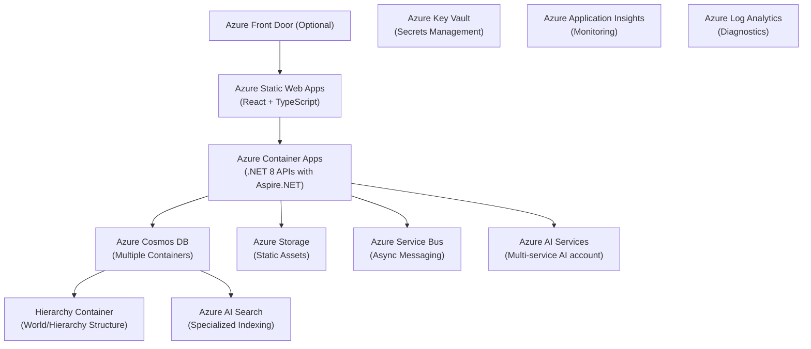
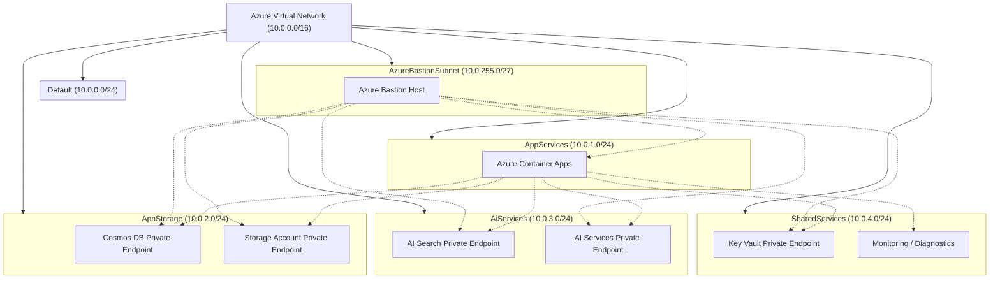

# Azure Infrastructure

Libris Maleficarum leverages Azure cloud services for scalability, security, and extensibility.

- **Frontend Hosting:** Azure Static Web Apps, optionally Azure Front Door.
- **Backend APIs:** Azure Container Apps (ACA) hosting .NET 8 APIs (Aspire.NET).
- **Data Storage:** Azure Cosmos DB (multiple containers), Azure Storage (Blob Storage).
- **AI & Search Services:** Azure AI Search, Azure AI Services.
- **Messaging & Eventing:** Azure Service Bus.
- **Security & Secrets Management:** Azure Key Vault.
- **Monitoring & Observability:** Azure Application Insights, Log Analytics.

All backend communications from the frontend and external services are routed exclusively through the API layer hosted in Azure Container Apps.

## Azure Architecture Diagram

## Networking

The solution uses a single Azure Virtual Network (VNet) with multiple subnets to segment and secure resources. Private Endpoints are used to securely connect Azure PaaS services to the VNet, ensuring all traffic remains on the Microsoft backbone.

### Subnet Structure

| Subnet Name         | Address Prefix  | Purpose / Linked Services                                      |
|---------------------|-----------------|----------------------------------------------------------------|
| Default             | 10.0.0.0/24     | Reserved (not used by default)                                 |
| AppServices         | 10.0.1.0/24     | Azure Container Apps (API backend)                             |
| AppStorage          | 10.0.2.0/24     | Cosmos DB Private Endpoint, Storage Account Private Endpoint   |
| AiServices          | 10.0.3.0/24     | Azure AI Search Private Endpoint, AI Services Private Endpoint |
| SharedServices      | 10.0.4.0/24     | Key Vault Private Endpoint, Monitoring, other shared services  |
| AzureBastionSubnet  | 10.0.255.0/27   | Azure Bastion Host                                             |

### Service-to-Subnet Mapping

- **Azure Container Apps:** Deployed in `AppServices` subnet.
- **Azure Cosmos DB:** Private Endpoint in `AppStorage` subnet.
- **Azure Storage Account:** Private Endpoint in `AppStorage` subnet.
- **Azure AI Search:** Private Endpoint in `AiServices` subnet.
- **Azure AI Services:** Private Endpoint in `AiServices` subnet.
- **Azure Key Vault:** Private Endpoint in `SharedServices` subnet.
- **Monitoring (App Insights, Log Analytics):** Linked via `SharedServices` subnet.
- **Azure Bastion:** Deployed in `AzureBastionSubnet`.

### Networking Design Diagram

**Notes:**

- All PaaS services are accessed via Private Endpoints, ensuring secure, private connectivity.
- Subnet design allows for clear separation of concerns and simplifies network security management.
- Azure Bastion provides secure RDP/SSH connectivity to resources without exposing public IPs.

## Infrastructure as Code (IaC)

- **Bicep Templates Location:** `infra/`
- **Deployment:** Automated via GitHub Actions workflows stored in the `.github` folder.
- **Secrets Management:** Secrets and sensitive configuration values securely managed via **Azure Key Vault**.
- **Monitoring & Observability:** Integrated with **Azure Application Insights** and **Log Analytics** for comprehensive monitoring and diagnostics.
- **Azure Verified Modules:** All Azure resources are deployed using [Azure Verified Modules (AVM)](https://aka.ms/avm) for Bicep wherever AVM modules are available. AVM ensures best practices, security, and maintainability for infrastructure code. Custom Bicep modules are only used for resources not yet supported by AVM.
