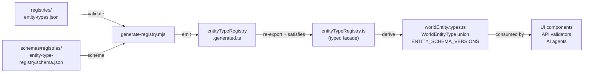

# Registry Architecture

This document specifies the architecture for the versioned Entity Type Registry and the Game System / System Properties Registry in Libris Maleficarum. It defines the data structures, versioning contracts, extension points, and frontend/backend integration patterns that govern how entity types and game-system schemas are discovered, validated, and rendered.

## Overview

Libris Maleficarum uses two complementary registries:

| Registry | Purpose | Source of Truth |
| -------- | ------- | --------------- |
| **Entity Type Registry** | Defines every `entityType` known to the system — its label, icon, category, property schema, and suggested child types | `registries/entity-types.json` (canonical data) + generated TypeScript runtime module |
| **Game System Registry** | Defines every supported game system (e.g., D&D 5e, Pathfinder 2e, generic fantasy) — its `systemProperties` schema, display metadata, and association to entity types | `schemas/` directory and backend configuration |

Both registries are **data-driven**: UI components, API validators, and AI agents read from these registries rather than hard-coding knowledge about specific entity types or systems.

---

## Entity Type Registry

### Purpose

The Entity Type Registry is the single source of truth for:

1. Which `entityType` values are valid (the `WorldEntityType` union type is derived from it).
1. The human-readable label, icon, and category for each entity type.
1. The `propertySchema` — the set of typed fields stored in `properties` for that entity type.
1. The current `schemaVersion` for each entity type's `properties` schema.
1. The `suggestedChildren` list used by the UI to populate the entity creation selector.

### Location

| Layer | File |
| ----- | ---- |
| Canonical data | `registries/entity-types.json` |
| Canonical schema | `schemas/registries/entity-type-registry.schema.json` |
| Code generation | `libris-maleficarum-app/scripts/generate-registry.mjs` |
| Generated runtime data | `libris-maleficarum-app/src/services/config/entityTypeRegistry.generated.ts` |
| Frontend typed facade | `libris-maleficarum-app/src/services/config/entityTypeRegistry.ts` |
| Backend (planned) | `libris-maleficarum-service/src/Domain/EntityTypes/EntityTypeRegistry.cs` |

### Data Structure

The canonical registry data lives in `registries/entity-types.json` and is validated against `schemas/registries/entity-type-registry.schema.json`. A build-time generator emits `entityTypeRegistry.generated.ts`, and the frontend facade re-exports that data as `ENTITY_TYPE_REGISTRY` with `satisfies readonly EntityTypeConfig[]` to retain compile-time checks.

Derived constants (`WorldEntityType`, `ENTITY_SCHEMA_VERSIONS`, `ENTITY_TYPE_META`) are generated from this array in `worldEntity.types.ts` to guarantee consistency.

```typescript
interface EntityTypeConfig {
  readonly type: string;                    // PascalCase; becomes WorldEntityType union member
  readonly label: string;                   // Human-readable display name
  readonly description: string;             // UI hint text
  readonly category: EntityTypeCategory;    // Grouping in selectors
  readonly icon: string;                    // Lucide icon component name
  readonly schemaVersion: number;           // Current version of the propertySchema
  readonly suggestedChildren: readonly string[];  // PascalCase entityType values
  readonly canBeRoot?: boolean;             // true for World only
  readonly propertySchema?: readonly PropertyFieldSchema[];
}

interface PropertyFieldSchema {
  readonly key: string;    // camelCase — used as Cosmos DB property bag key
  readonly label: string;  // Human-readable display name
  readonly type: PropertyFieldType;
  readonly placeholder?: string;
  readonly description?: string;
  readonly maxLength?: number;
  readonly validation?: PropertyFieldValidation;
}
```

### Naming Rules

| Field | Convention | Example |
| ----- | ---------- | ------- |
| `type` | PascalCase | `'GeographicRegion'` |
| `suggestedChildren` strings | PascalCase | `'Country'` |
| `key` inside `propertySchema` | camelCase | `'commandStructure'` |
| `label` (display) | Title Case with spaces | `'Command Structure'` |

> [!IMPORTANT]
> `key` values in `propertySchema` are the Cosmos DB property bag keys. They **must** be camelCase and match the persistence naming standard defined in [data_model.md](data_model.md). Changing a `key` value after data has been persisted is a breaking schema change requiring a `schemaVersion` increment.

### Derived Constants

The following are generated from `ENTITY_TYPE_REGISTRY` in `libris-maleficarum-app/src/services/types/worldEntity.types.ts` at module load time. Never define these independently:

| Constant | Type | How Derived |
| -------- | ---- | ----------- |
| `WorldEntityType` | `readonly { [K in WorldEntityTypeLiteral]: K }` | `.reduce()` builds `type -> type` const map from registry entries |
| `ENTITY_SCHEMA_VERSIONS` | `Record<WorldEntityType, number>` | Map of `type → schemaVersion` |
| `ENTITY_TYPE_META` | `Record<WorldEntityType, EntityTypeConfig>` | Map of `type → full config` |
| `ENTITY_TYPE_SUGGESTIONS` | `Record<WorldEntityType, string[]>` | Map of `type → suggestedChildren` |

### Data-Driven Source Flow



1. Authors edit `registries/entity-types.json`.
1. `pnpm gen:registry` validates JSON against `schemas/registries/entity-type-registry.schema.json`.
1. The generator writes `entityTypeRegistry.generated.ts`.
1. `entityTypeRegistry.ts` re-exports the generated data with TypeScript constraints.
1. `worldEntity.types.ts` derives runtime maps and literal unions from the re-export.

This keeps v1 data-driven while preserving static typing and synchronous startup behavior. A future version can replace the JSON source with runtime backend retrieval and in-memory caching without changing consumer components.

### Property Field Types

| Type | Input Control | Storage Type | Notes |
| ---- | ------------- | ------------ | ----- |
| `text` | `<input type="text">` | `string` | Single-line |
| `textarea` | `<textarea>` | `string` | Multi-line; preserved whitespace on display |
| `integer` | Numeric input | `number` | Rendered with thousand separators |
| `decimal` | Numeric input | `number` | Rendered with thousand separators and decimal places |
| `tagArray` | Tag input | `string[]` | Rendered as badge list |
| `date` | `<input type="date">` | `string` (ISO 8601 date) | `YYYY-MM-DD` |
| `datetime` | `<input type="datetime-local">` | `string` (ISO 8601) | UTC |
| `time` | `<input type="time">` | `string` | `HH:MM` |

### Schema Versioning

Each entity type carries a `schemaVersion` integer. This is the version of its `propertySchema` — the set of fields in `properties`.

#### When to Increment

| Change | Version Increment |
| ------ | ----------------- |
| Rename a `key` | **Required** |
| Change a field's `type` | **Required** |
| Add a required field | **Required** |
| Remove a field | **Required** |
| Add an optional field | Optional |
| Change `label`, `placeholder`, or `description` only | Not required |

#### Version Lifecycle

1. **Increment** `schemaVersion` in `registries/entity-types.json` for the affected entity type.
1. **Add migration logic** in `WorldEntityMigrationService` (backend) to transform `properties` objects from old versions to the new structure.
1. **Regenerate** `entityTypeRegistry.generated.ts` using `pnpm gen:registry`.
1. **Update** `ENTITY_SCHEMA_VERSIONS` tests in `entityTypeRegistry.test.ts`.
1. **Document** the change in `schema_version_matrix.md` and `CHANGELOG.md`.

The `schemaVersion` in the registry is always the **current** version. The backend supports reading older versions through lazy migration — entities are upgraded on save. See [schema_version_matrix.md](schema_version_matrix.md) for CREATE/UPDATE validation rules.

### Extensibility

New entity types are added by appending to `registries/entity-types.json`. No code changes are needed elsewhere: all derived constants, the `WorldEntityType` union, and the form renderer pick up the new type automatically after code generation.

To add a new entity type:

1. Append an `EntityTypeConfig` entry to `registries/entity-types.json`.
1. Define `propertySchema` with camelCase `key` values.
1. Set `schemaVersion: 1`.
1. Run `pnpm gen:registry` to regenerate `entityTypeRegistry.generated.ts`.
1. Run `pnpm build` and `pnpm test` to validate.
1. The backend `EntityTypeValidator` must also register the new type (see backend section below).

See [entityTypeRegistry.extensibility.test.tsx](../../libris-maleficarum-app/src/services/config/__tests__/entityTypeRegistry.extensibility.test.tsx) for a test that validates the extensibility contract.

---

## Game System Registry

### Purpose

The Game System Registry defines every supported game system (ruleset). It governs:

1. Which `systemProperties` fields are expected for a given `entityType` + `gameSystem` combination.
1. The display metadata (name, abbreviation, icon) for each game system.
1. Which entity types a game system supports.

The Game System Registry is separate from the Entity Type Registry because:

- The same `entityType` (e.g., `Character`) may have very different `systemProperties` in D&D 5e vs. Pathfinder 2e vs. a generic fantasy system.
- Worlds can switch game systems. The `properties` field stays stable; only `systemProperties` changes with the system.
- New game systems can be added without touching entity type definitions.

### Location (Planned)

| Layer | File |
| ----- | ---- |
| JSON Schemas | `schemas/systems/{systemId}/{entityType}.schema.json` |
| Registry instances | `registries/systems/{systemId}.json` |
| Frontend loader | `libris-maleficarum-app/src/services/config/gameSystemRegistry.ts` (planned) |
| Backend (planned) | `libris-maleficarum-service/src/Domain/GameSystems/GameSystemRegistry.cs` |

### Data Structure (Planned)

```typescript
interface GameSystemConfig {
  readonly id: string;           // kebab-case; e.g., 'dnd5e', 'pathfinder2e', 'generic-fantasy'
  readonly name: string;         // Human-readable; e.g., 'Dungeons & Dragons 5th Edition'
  readonly abbreviation: string; // e.g., 'D&D 5e'
  readonly icon?: string;        // Optional Lucide icon
  readonly supportedEntityTypes: readonly string[];  // PascalCase WorldEntityType values
  readonly systemPropertySchemas: Readonly<Record<string, readonly PropertyFieldSchema[]>>;
  // Key: PascalCase entityType; Value: systemProperties schema for that type
}
```

### System Properties vs Entity Properties

| Bag | Governed By | Stability | Example Fields |
| --- | ----------- | --------- | -------------- |
| `properties` | Entity Type Registry | Stable across game systems | `population`, `climate`, `level` |
| `systemProperties` | Game System Registry | System-specific | `armorClass` (D&D 5e), `savingThrowDC` (Pathfinder) |

### Schema IDs

`schemaId` on a `WorldEntity` document references a specific Game System Registry entry. It drives which `systemProperties` schema is applied for validation and form rendering.

Format: `{systemId}-{entityType}` (all lowercase, hyphen-separated)

Examples:
- `dnd5e-character`
- `pathfinder2e-character`
- `generic-fantasy-location`
- `geographic-region` (no system — properties only)

When `schemaId` is null or absent, only the `propertySchema` from the Entity Type Registry applies. `systemProperties` is treated as unvalidated free-form JSON.

---

## JSON Schema Files (Planned)

Formal JSON Schema documents will be published under `schemas/` for use by:

- The backend property validator (`SystemPropertySchemaValidator`)
- The AI content generation agent (to understand valid field constraints)
- External tooling and import/export pipelines

### Directory Structure (Planned)

```
schemas/
  entity-types/
    geographic-region.schema.json
    political-region.schema.json
    military-region.schema.json
    cultural-region.schema.json
    character.schema.json
    # ... one file per entity type with a propertySchema
  systems/
    dnd5e/
      character.schema.json
      location.schema.json
    pathfinder2e/
      character.schema.json
    generic-fantasy/
      character.schema.json
      location.schema.json
registries/
  systems/
    dnd5e.json
    pathfinder2e.json
    generic-fantasy.json
```

### Schema File Format (Planned)

```json
{
  "$schema": "https://json-schema.org/draft/2020-12/schema",
  "$id": "https://libris-maleficarum.dev/schemas/entity-types/geographic-region.schema.json",
  "title": "Geographic Region Properties",
  "description": "Schema for the properties bag of a GeographicRegion entity",
  "type": "object",
  "properties": {
    "climate": {
      "type": "string",
      "title": "Climate",
      "maxLength": 500
    },
    "terrain": {
      "type": "string",
      "title": "Terrain",
      "maxLength": 1000
    },
    "population": {
      "type": "integer",
      "title": "Population",
      "minimum": 0
    },
    "area": {
      "type": "number",
      "title": "Area (sq km)",
      "minimum": 0
    }
  },
  "additionalProperties": true
}
```

> [!NOTE]
> `additionalProperties: true` is intentional. The `properties` bag is extensible; unknown fields from older or newer schema versions are preserved rather than rejected.

---

## Frontend Integration

### Component Responsibilities

| Component | Registry Interaction |
| --------- | ------------------- |
| `EntityTypeSelector` | Reads `ENTITY_TYPE_META` to render grouped options with icons and descriptions |
| `DynamicPropertiesForm` | Reads `propertySchema` for the selected `entityType` to render typed form fields |
| `DynamicPropertiesView` | Reads `propertySchema` to render property values with correct formatting (numbers, badges, multiline) |
| `EntityDetailReadOnlyView` | Composes `DynamicPropertiesView` + `DynamicPropertiesSystemView` (planned) |
| `WorldEntityForm` | Combines entity base fields + `DynamicPropertiesForm` for create/edit |

### Property Key Contract

Form fields write to and read from a plain JavaScript object (`Record<string, unknown>`) where keys are the `key` values from `propertySchema`. This object is stored as `properties` on the `WorldEntity` document in Cosmos DB.

```typescript
// Form output example for GeographicRegion:
const properties: Record<string, unknown> = {
  climate: 'Tropical monsoon',
  terrain: 'Dense rainforest',
  population: 1_500_000,
  area: 2_500.75,
};
```

All keys are camelCase. PascalCase keys in this bag are a bug — the previous convention (before schema v1 stabilization) is no longer valid.

### Schema Version Injection

The frontend injects `schemaVersion` on every create and update request using the value from `ENTITY_SCHEMA_VERSIONS`:

```typescript
import { ENTITY_SCHEMA_VERSIONS } from '@/services/types/worldEntity.types';

const payload = {
  ...formData,
  properties,
  schemaVersion: ENTITY_SCHEMA_VERSIONS[entityType],
};
```

See [schema_version_matrix.md](schema_version_matrix.md) for full CREATE/UPDATE validation matrices.

---

## Backend Integration (Planned)

### Validation Points

| Layer | What Is Validated |
| ----- | ----------------- |
| API controller | `entityType` is a known registered type; `schemaVersion` is within `[1, MAX]` |
| Domain service | `schemaVersion` is not a downgrade on UPDATE |
| Infrastructure | EF Core converts `schemaVersion: 0` → `1` for pre-versioning documents |

### Migration Service (Planned)

`WorldEntityMigrationService` applies lazy migrations when an entity is loaded at a lower `schemaVersion` than the current registry version:

```csharp
public class WorldEntityMigrationService
{
    public BaseWorldEntity MigrateProperties(BaseWorldEntity entity, int targetVersion)
    {
        // Apply incremental migration steps from entity.SchemaVersion to targetVersion
        // Each step is registered as a MigrationStep(fromVersion, entityType, transform)
    }
}
```

Migrations run on read (for display) and are persisted on the next save.

---

## Current State vs Roadmap

| Item | Status |
| ---- | ------ |
| `ENTITY_TYPE_REGISTRY` — all entity types, camelCase `key` values | ✅ Complete |
| `DynamicPropertiesForm` — reads registry, renders typed fields | ✅ Complete |
| `DynamicPropertiesView` — reads registry, formats values | ✅ Complete |
| `EntityTypeSelector` — reads registry for grouped selector | ✅ Complete |
| `ENTITY_SCHEMA_VERSIONS` — frontend schema version map | ✅ Complete |
| Canonical registry JSON (`registries/entity-types.json`) | ✅ Complete |
| Registry JSON Schema (`schemas/registries/entity-type-registry.schema.json`) | ✅ Complete |
| Registry codegen (`scripts/generate-registry.mjs` + generated TS) | ✅ Complete |
| Game System Registry (`gameSystemRegistry.ts`) | 🗺 Roadmap |
| `systemProperties` form rendering (`DynamicSystemPropertiesForm`) | 🗺 Roadmap |
| Backend `EntityTypeRegistry.cs` | 🗺 Roadmap |
| Backend `WorldEntityMigrationService` | 🗺 Roadmap |
| Backend `SystemPropertySchemaValidator` | 🗺 Roadmap |

---

## Related Documents

- [data_model.md](data_model.md) — persistence contract, camelCase naming rules, `properties` vs `systemProperties`
- [schema_version_matrix.md](schema_version_matrix.md) — CREATE/UPDATE version validation matrices
- [api.md](api.md) — REST endpoint specifications for entity CRUD
- [frontend.md](frontend.md) — React component architecture
