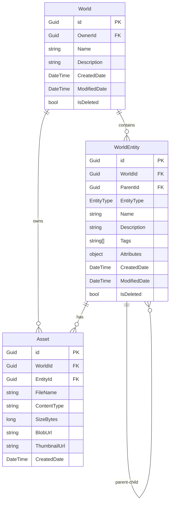

# Data Model: Backend REST API with Cosmos DB Integration

**Phase**: 1 - Design & Contracts  
**Date**: 2026-01-03  
**Purpose**: Define entity schemas, relationships, validation rules, and Cosmos DB container structure

## Overview

The data model uses Clean Architecture principles with domain entities in the Domain layer and EF Core configurations in the Infrastructure layer. All entities use GUID identifiers and support soft deletion. Cosmos DB containers use partition keys for optimal performance and cost management.

## Cosmos DB Container Strategy

### Container: `Worlds`

Stores root-level world aggregates owned by users.

**Partition Key**: `/id` (each world is its own partition)

**Rationale**: Worlds are independent aggregates; partitioning by World ID isolates user data and enables efficient single-world queries.

| Property | Type | Description | Validation |
| -------- | ---- | ----------- | ---------- |
| `id` | `string` (GUID) | Unique world identifier | Required, immutable |
| `OwnerId` | `string` (GUID) | User who owns this world | Required, indexed for cross-partition queries |
| `Name` | `string` | World name | Required, 1-100 characters |
| `Description` | `string?` | World description | Optional, max 2000 characters |
| `CreatedDate` | `DateTime` | UTC creation timestamp | Required, auto-set |
| `ModifiedDate` | `DateTime` | UTC last modification timestamp | Required, auto-updated |
| `IsDeleted` | `bool` | Soft delete flag | Required, default `false` |
| `_etag` | `string` | Cosmos DB ETag for optimistic concurrency | Auto-managed by Cosmos DB |

**Indexes**:

- Default index on `/id` (partition key)
- Composite index on `/OwnerId` for user-scoped queries (cross-partition)

---

### Container: `WorldEntities`

Stores all entities within worlds (locations, characters, campaigns, etc.).

**Partition Key**: `/WorldId`

**Rationale**: All entities in a world share the same partition for efficient hierarchical queries and world-scoped operations.

| Property | Type | Description | Validation |
| -------- | ---- | ----------- | ---------- |
| `id` | `string` (GUID) | Unique entity identifier | Required, immutable |
| `WorldId` | `string` (GUID) | Parent world identifier (partition key) | Required, immutable |
| `ParentId` | `string?` (GUID) | Parent entity identifier (for hierarchy) | Optional, nullable |
| `EntityType` | `string` (enum) | Entity type (see EntityType enum) | Required, validated enum value |
| `Name` | `string` | Entity name | Required, 1-200 characters |
| `Description` | `string?` | Entity description | Optional, max 5000 characters |
| `Tags` | `string[]` | Array of tags for categorization | Optional, max 20 tags, each max 50 chars |
| `Attributes` | `object` (JSON) | Flexible custom attributes (key-value pairs) | Optional, max 100KB serialized |
| `CreatedDate` | `DateTime` | UTC creation timestamp | Required, auto-set |
| `ModifiedDate` | `DateTime` | UTC last modification timestamp | Required, auto-updated |
| `IsDeleted` | `bool` | Soft delete flag | Required, default `false` |
| `_etag` | `string` | Cosmos DB ETag for optimistic concurrency | Auto-managed by Cosmos DB |

**Indexes**:

- Default index on `/WorldId` (partition key)
- Composite index on `/WorldId, /EntityType` for filtered queries
- Composite index on `/WorldId, /ParentId` for hierarchical queries
- Composite index on `/WorldId, /Tags` for tag-based searches

**Hierarchical Structure**:

```text
World (Root - in Worlds container)
├─ Continent (WorldEntity)
│  ├─ Country (WorldEntity, ParentId = Continent.Id)
│  │  ├─ Region (WorldEntity, ParentId = Country.Id)
│  │  │  └─ City (WorldEntity, ParentId = Region.Id)
├─ Campaign (WorldEntity)
│  ├─ Chapter (WorldEntity, ParentId = Campaign.Id)
│  │  └─ Scene (WorldEntity, ParentId = Chapter.Id)
├─ Character (WorldEntity)
```

---

### Container: `Assets`

Stores metadata for uploaded media files (images, audio, video, documents).

**Partition Key**: `/WorldId`

**Rationale**: Assets belong to worlds; partitioning by World ID enables efficient world-scoped asset queries and cleanup.

| Property | Type | Description | Validation |
| -------- | ---- | ----------- | ---------- |
| `id` | `string` (GUID) | Unique asset identifier | Required, immutable |
| `WorldId` | `string` (GUID) | Parent world identifier (partition key) | Required, immutable |
| `EntityId` | `string?` (GUID) | Associated entity identifier | Optional, nullable |
| `FileName` | `string` | Original file name | Required, max 255 characters |
| `ContentType` | `string` | MIME type (e.g., `image/jpeg`) | Required, validated against allowed types |
| `SizeBytes` | `long` | File size in bytes | Required, max 25MB (configurable) |
| `BlobUrl` | `string` | Azure Blob Storage URL | Required, generated during upload |
| `ThumbnailUrl` | `string?` | Thumbnail URL (for images) | Optional, generated for image types |
| `CreatedDate` | `DateTime` | UTC upload timestamp | Required, auto-set |
| `_etag` | `string` | Cosmos DB ETag | Auto-managed by Cosmos DB |

**Allowed Content Types** (FR-019b):

- **Images**: `image/jpeg`, `image/png`, `image/gif`, `image/webp`
- **Audio**: `audio/mpeg`, `audio/wav`, `audio/ogg`
- **Video**: `video/mp4`, `video/webm`
- **Documents**: `application/pdf`, `text/plain`, `text/markdown`

**Indexes**:

- Default index on `/WorldId` (partition key)
- Composite index on `/WorldId, /EntityId` for entity-scoped assets

---

### Container: `DeletedWorldEntities`

Stores soft-deleted entities for potential recovery (30-day retention).

**Partition Key**: `/OriginalWorldId`

**Rationale**: Segregates deleted entities from active data; enables bulk cleanup after retention period.

| Property | Type | Description | Validation |
| -------- | ---- | ----------- | ---------- |
| `id` | `string` (GUID) | Unique deleted entity identifier (new GUID) | Required, immutable |
| `OriginalWorldId` | `string` (GUID) | Original world identifier (partition key) | Required, immutable |
| `OriginalEntityId` | `string` (GUID) | Original entity identifier | Required, indexed |
| `OriginalData` | `object` (JSON) | Serialized original entity | Required, full entity snapshot |
| `DeletedDate` | `DateTime` | UTC deletion timestamp | Required, auto-set |
| `DeletedBy` | `string` (GUID) | User who deleted the entity | Required |
| `ExpiresAt` | `DateTime` | TTL expiration (deletion date + 30 days) | Required, Cosmos DB TTL |

**Indexes**:

- Default index on `/OriginalWorldId` (partition key)
- TTL index on `/ExpiresAt` for automatic cleanup

---

## Domain Entities (C# Classes)

### World.cs (Domain/Entities/)

```csharp
public class World
{
    public Guid Id { get; private set; }
    public Guid OwnerId { get; private set; }
    public string Name { get; private set; }
    public string? Description { get; private set; }
    public DateTime CreatedDate { get; private set; }
    public DateTime ModifiedDate { get; private set; }
    public bool IsDeleted { get; private set; }
    
    // EF Core navigation properties (not stored in Cosmos)
    public ICollection<WorldEntity> Entities { get; set; } = new List<WorldEntity>();
    
    // Private constructor for EF Core
    private World() { }
    
    // Public constructor for domain creation
    public World(Guid id, Guid ownerId, string name, string? description = null)
    {
        Id = id;
        OwnerId = ownerId;
        Name = name ?? throw new ArgumentNullException(nameof(name));
        Description = description;
        CreatedDate = DateTime.UtcNow;
        ModifiedDate = DateTime.UtcNow;
        IsDeleted = false;
        
        Validate();
    }
    
    public void Update(string name, string? description)
    {
        Name = name ?? throw new ArgumentNullException(nameof(name));
        Description = description;
        ModifiedDate = DateTime.UtcNow;
        
        Validate();
    }
    
    public void SoftDelete()
    {
        IsDeleted = true;
        ModifiedDate = DateTime.UtcNow;
    }
    
    private void Validate()
    {
        if (string.IsNullOrWhiteSpace(Name))
            throw new ValidationException("World name is required");
        
        if (Name.Length > 100)
            throw new ValidationException("World name must not exceed 100 characters");
        
        if (Description != null && Description.Length > 2000)
            throw new ValidationException("Description must not exceed 2000 characters");
    }
}
```

---

### WorldEntity.cs (Domain/Entities/)

```csharp
public class WorldEntity
{
    public Guid Id { get; private set; }
    public Guid WorldId { get; private set; }
    public Guid? ParentId { get; private set; }
    public EntityType EntityType { get; private set; }
    public string Name { get; private set; }
    public string? Description { get; private set; }
    public List<string> Tags { get; private set; } = new();
    public Dictionary<string, object> Attributes { get; private set; } = new();
    public DateTime CreatedDate { get; private set; }
    public DateTime ModifiedDate { get; private set; }
    public bool IsDeleted { get; private set; }
    
    // Navigation properties
    public World World { get; set; } = null!;
    public WorldEntity? Parent { get; set; }
    public ICollection<WorldEntity> Children { get; set; } = new List<WorldEntity>();
    
    private WorldEntity() { }
    
    public WorldEntity(Guid id, Guid worldId, EntityType entityType, string name, 
        Guid? parentId = null, string? description = null)
    {
        Id = id;
        WorldId = worldId;
        ParentId = parentId;
        EntityType = entityType;
        Name = name ?? throw new ArgumentNullException(nameof(name));
        Description = description;
        CreatedDate = DateTime.UtcNow;
        ModifiedDate = DateTime.UtcNow;
        IsDeleted = false;
        
        Validate();
    }
    
    public void Update(string name, string? description, List<string>? tags = null, 
        Dictionary<string, object>? attributes = null)
    {
        Name = name ?? throw new ArgumentNullException(nameof(name));
        Description = description;
        if (tags != null) Tags = tags;
        if (attributes != null) Attributes = attributes;
        ModifiedDate = DateTime.UtcNow;
        
        Validate();
    }
    
    public void Move(Guid? newParentId)
    {
        ParentId = newParentId;
        ModifiedDate = DateTime.UtcNow;
    }
    
    public void SoftDelete()
    {
        IsDeleted = true;
        ModifiedDate = DateTime.UtcNow;
    }
    
    private void Validate()
    {
        if (string.IsNullOrWhiteSpace(Name))
            throw new ValidationException("Entity name is required");
        
        if (Name.Length > 200)
            throw new ValidationException("Entity name must not exceed 200 characters");
        
        if (Description != null && Description.Length > 5000)
            throw new ValidationException("Description must not exceed 5000 characters");
        
        if (Tags.Count > 20)
            throw new ValidationException("Maximum 20 tags allowed");
        
        if (Tags.Any(t => t.Length > 50))
            throw new ValidationException("Tag length must not exceed 50 characters");
    }
}
```

---

### Asset.cs (Domain/Entities/)

```csharp
public class Asset
{
    public Guid Id { get; private set; }
    public Guid WorldId { get; private set; }
    public Guid? EntityId { get; private set; }
    public string FileName { get; private set; }
    public string ContentType { get; private set; }
    public long SizeBytes { get; private set; }
    public string BlobUrl { get; private set; }
    public string? ThumbnailUrl { get; private set; }
    public DateTime CreatedDate { get; private set; }
    
    // Navigation properties
    public World World { get; set; } = null!;
    public WorldEntity? Entity { get; set; }
    
    private Asset() { }
    
    public Asset(Guid id, Guid worldId, string fileName, string contentType, 
        long sizeBytes, string blobUrl, Guid? entityId = null)
    {
        Id = id;
        WorldId = worldId;
        EntityId = entityId;
        FileName = fileName ?? throw new ArgumentNullException(nameof(fileName));
        ContentType = contentType ?? throw new ArgumentNullException(nameof(contentType));
        SizeBytes = sizeBytes;
        BlobUrl = blobUrl ?? throw new ArgumentNullException(nameof(blobUrl));
        CreatedDate = DateTime.UtcNow;
        
        Validate();
    }
    
    public void SetThumbnail(string thumbnailUrl)
    {
        ThumbnailUrl = thumbnailUrl;
    }
    
    private void Validate()
    {
        if (FileName.Length > 255)
            throw new ValidationException("File name must not exceed 255 characters");
        
        var maxSizeBytes = 25 * 1024 * 1024; // 25MB default (should be configurable)
        if (SizeBytes > maxSizeBytes)
            throw new ValidationException($"File size must not exceed {maxSizeBytes / (1024 * 1024)}MB");
        
        var allowedTypes = new[]
        {
            "image/jpeg", "image/png", "image/gif", "image/webp",
            "audio/mpeg", "audio/wav", "audio/ogg",
            "video/mp4", "video/webm",
            "application/pdf", "text/plain", "text/markdown"
        };
        
        if (!allowedTypes.Contains(ContentType, StringComparer.OrdinalIgnoreCase))
            throw new ValidationException($"Content type '{ContentType}' is not allowed");
    }
}
```

---

## Value Objects

### EntityType.cs (Domain/ValueObjects/)

> **Source of Truth**: This enum definition in `Domain/ValueObjects/EntityType.cs` is the authoritative source for all entity types. OpenAPI contract schemas in `contracts/entities.yaml` and task descriptions must reference this canonical list. Any additions/changes to entity types MUST start here.

```csharp
public enum EntityType
{
    // Geographic entities
    Continent,
    Country,
    Region,
    City,
    Location,
    
    // Narrative entities
    Campaign,
    Chapter,
    Scene,
    Event,
    
    // Character entities
    Character,
    Organization,
    Faction,
    
    // World-building entities
    Culture,
    Religion,
    Language,
    Item,
    
    // Custom/Generic
    Custom
}
```

---

## Entity Relationships



---

## EF Core Configuration Examples

### WorldConfiguration.cs (Infrastructure/Persistence/Configurations/)

```csharp
public class WorldConfiguration : IEntityTypeConfiguration<World>
{
    public void Configure(EntityTypeBuilder<World> builder)
    {
        builder.ToContainer("Worlds");
        builder.HasPartitionKey(w => w.Id);
        builder.HasNoDiscriminator();
        
        builder.HasKey(w => w.Id);
        builder.Property(w => w.Id).ToJsonProperty("id").IsRequired();
        builder.Property(w => w.OwnerId).ToJsonProperty("OwnerId").IsRequired();
        builder.Property(w => w.Name).ToJsonProperty("Name").IsRequired().HasMaxLength(100);
        builder.Property(w => w.Description).ToJsonProperty("Description").HasMaxLength(2000);
        builder.Property(w => w.CreatedDate).ToJsonProperty("CreatedDate").IsRequired();
        builder.Property(w => w.ModifiedDate).ToJsonProperty("ModifiedDate").IsRequired();
        builder.Property(w => w.IsDeleted).ToJsonProperty("IsDeleted").IsRequired();
        
        // Ignore navigation properties (Cosmos doesn't support relationships natively)
        builder.Ignore(w => w.Entities);
    }
}
```

---

## Validation Rules Summary

| Entity | Field | Rule |
| ------ | ----- | ---- |
| World | Name | Required, 1-100 chars |
| World | Description | Optional, max 2000 chars |
| WorldEntity | Name | Required, 1-200 chars |
| WorldEntity | Description | Optional, max 5000 chars |
| WorldEntity | Tags | Max 20 tags, each max 50 chars |
| WorldEntity | Attributes | Max 100KB serialized JSON |
| Asset | FileName | Required, max 255 chars |
| Asset | ContentType | Required, must be in allowed list |
| Asset | SizeBytes | Max 25MB (configurable via runtime config) |

---

## State Transitions

### World Lifecycle

```text
Created (IsDeleted=false) 
  → Updated (Name/Description modified, ModifiedDate updated)
  → Soft Deleted (IsDeleted=true, ModifiedDate updated)
  → [30 days retention] → Purged (removed from DeletedWorldEntities by TTL)
```

### Entity Lifecycle

```text
Created (IsDeleted=false, ParentId set or null)
  → Updated (Name/Description/Tags/Attributes modified)
  → Moved (ParentId changed)
  → Soft Deleted (IsDeleted=true or cascade delete if parent deleted with cascade=true)
  → [30 days retention] → Purged
```

---

## Performance Considerations

1. **Partition Key Strategy**: All queries should include partition key (`WorldId`) to avoid cross-partition queries where possible
1. **Indexing**: Composite indexes defined for common query patterns (EntityType, Tags, ParentId)
1. **Item Size Limit**: Cosmos DB has 2MB item limit; `Attributes` field limited to 100KB to leave headroom
1. **ETag Concurrency**: EF Core automatically uses `_etag` for optimistic concurrency (409 Conflict on mismatch)
1. **Soft Deletes**: Deleted entities moved to separate container to avoid polluting active data queries

---

## Next Steps

Proceed to create:

1. `contracts/` with OpenAPI specifications defining request/response schemas
1. `quickstart.md` with developer setup and testing instructions
