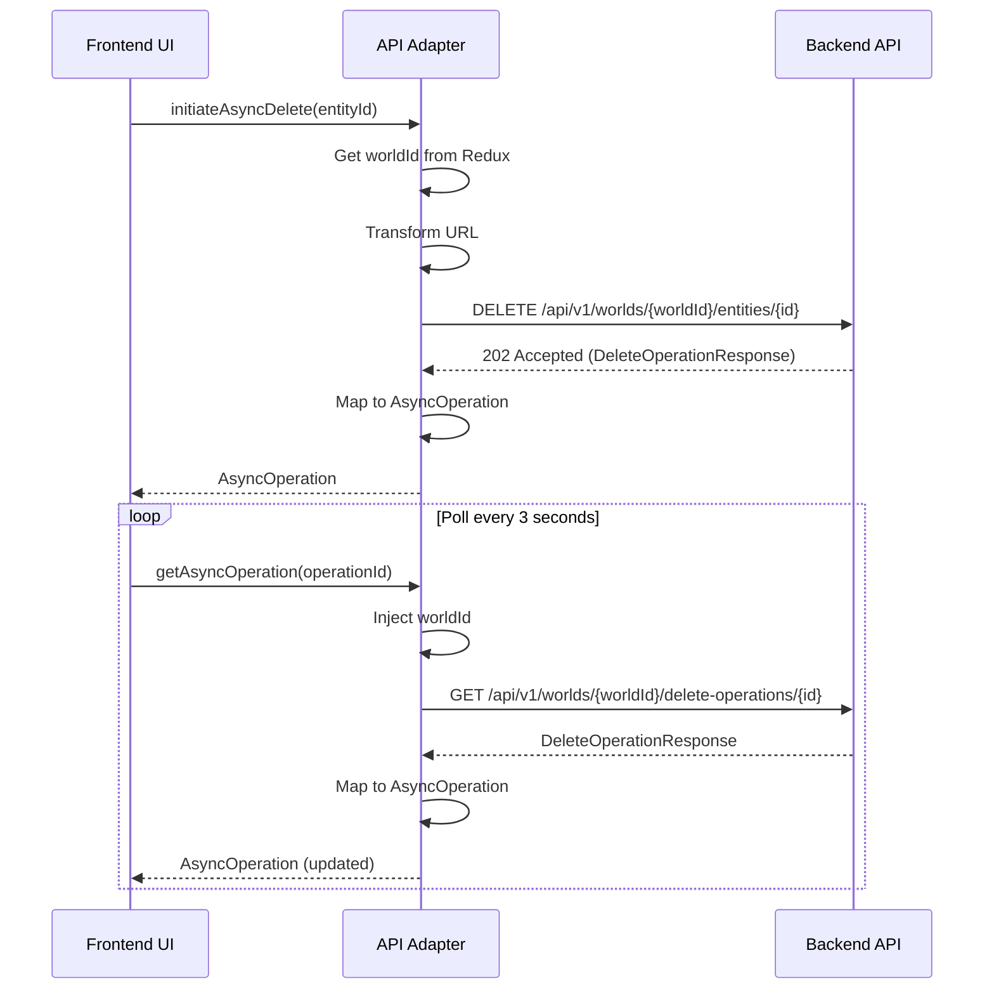

# Frontend-Backend Compatibility Analysis

## Async Entity Operations (Spec 012) ↔ Soft Delete API (Spec 011)

**Analysis Date**: February 3, 2026  
**Status**: ⚠️ **INTEGRATION BLOCKED** - See action items below  
**Effort Required**: ~2-4 days (Priority 1 items)

---

## Quick Links

- **📊 [Full Compatibility Report](./FRONTEND_BACKEND_COMPATIBILITY_REPORT.md)** - Detailed analysis of all incompatibilities
- **✅ [Integration Action Items](./INTEGRATION_ACTION_ITEMS.md)** - Prioritized checklist of required work
- **📖 [Frontend Spec](./spec.md)** - Spec 012 requirements
- **📖 [Backend Spec](../011-soft-delete-entities/spec.md)** - Spec 011 implementation

---

## TL;DR

### The Good ✅

- Backend delete **IS async** (returns 202 Accepted, processes in background)
- Both systems use similar polling patterns for status updates
- Response data contains all necessary information (with mapping)

### The Bad ❌

- **URL structure mismatch**: Frontend expects `/api/async-operations`, backend provides `/api/v1/worlds/{worldId}/delete-operations`
- **HTTP method mismatch**: Frontend uses POST, backend uses DELETE
- **Missing endpoints**: Backend doesn't implement retry/cancel operations
- **Response shape differences**: Different field names and structures

### The Verdict ⚠️

**Integration is BLOCKED** until blocking issues are resolved.

---

## Critical Blockers (Priority 1)

### Backend Work

1. **Implement retry endpoint** (4-8 hours)
   - `POST /api/v1/worlds/{worldId}/delete-operations/{operationId}/retry`
   - Resets failed operations to pending status
   - Required per frontend spec FR-014

### Frontend Work

2. **Create API adapter layer** (8-16 hours)
   - Maps frontend URLs → backend URLs
   - Transforms backend DTOs → frontend types
   - Handles field name differences
   - See [compatibility report](./FRONTEND_BACKEND_COMPATIBILITY_REPORT.md#example-frontend-api-adapter) for code example

1. **Change HTTP method to DELETE** (5 minutes)
   - Update `initiateAsyncDelete` mutation

1. **Inject worldId parameter** (2-4 hours)
   - Provide worldId in all API calls
   - Ensure worldId available in Redux state

---

## Key Incompatibilities

### Endpoint Paths

| Frontend Expects | Backend Provides | Status |
|-----------------|------------------|--------|
| `POST /api/world-entities/{id}/async-delete` | `DELETE /api/v1/worlds/{worldId}/entities/{id}` | ❌ Incompatible |
| `GET /api/async-operations` | `GET /api/v1/worlds/{worldId}/delete-operations` | ⚠️ Needs worldId |
| `GET /api/async-operations/{id}` | `GET /api/v1/worlds/{worldId}/delete-operations/{id}` | ⚠️ Needs worldId |
| `POST /api/async-operations/{id}/retry` | ❌ Not implemented | ❌ Missing |
| `POST /api/async-operations/{id}/cancel` | ❌ Not implemented | ❌ Missing |

### Response Shape Differences

| Frontend Field | Backend Field | Mapping Required |
|---------------|---------------|------------------|
| `targetEntityId` | `RootEntityId` | ✅ Rename |
| `targetEntityName` | `RootEntityName` | ✅ Rename |
| `targetEntityType` | ❌ Missing | ✅ Derive or omit |
| `type` | ❌ Missing | ✅ Hardcode 'DELETE' |
| `progress` | Computed from multiple fields | ✅ Calculate |
| `result` | Computed from multiple fields | ✅ Calculate |
| `startTimestamp` | `CreatedAt` (not `StartedAt`) | ✅ Map differently |

### Status Values

| Frontend | Backend | Mapping |
|----------|---------|---------|
| `'pending'` | `"pending"` | ✅ Direct |
| `'in-progress'` | `"in_progress"` | ✅ Direct |
| `'completed'` | `"completed"` | ✅ Direct |
| `'failed'` | `"failed"` OR `"partial"` | ⚠️ Map partial → failed |
| `'cancelled'` | ❌ Not supported | ❌ Remove feature |

---

## Recommended Approach

### Phase 1: Minimal Integration (Priority 1)

**Timeline**: 2-4 days  
**Goal**: Get basic functionality working

1. Backend implements retry endpoint
1. Frontend implements adapter layer
1. Frontend changes HTTP method to DELETE
1. Frontend injects worldId in all calls
1. Frontend removes cancel feature (backend doesn't support)
1. Integration testing

### Phase 2: Production Hardening (Priority 2)

**Timeline**: 3-5 days  
**Goal**: Production-ready quality

1. Backend adds `type` field to operations
1. Frontend implements comprehensive error handling
1. Frontend implements client-side filtering
1. Extensive E2E testing
1. Performance testing (10+ concurrent operations)
1. Accessibility testing

### Phase 3: Enhancements (Priority 3)

**Timeline**: Future sprint  
**Goal**: Optimal user experience

1. Backend adds cancel operation support
1. Backend adds user-scoped operation list
1. Backend adds estimated completion time
1. Migrate to Server-Sent Events (remove polling)

---

## Integration Workflow

---

## Next Steps

1. **Backend Team**:
   - [ ] Review retry endpoint requirements
   - [ ] Estimate and schedule implementation
   - [ ] Communicate timeline to frontend team

1. **Frontend Team**:
   - [ ] Review adapter layer requirements
   - [ ] Start implementation (can parallel with backend work)
   - [ ] Prepare integration tests

1. **Both Teams**:
   - [ ] Schedule integration session (after Priority 1 complete)
   - [ ] Align on testing approach
   - [ ] Document integration learnings

---

## Questions & Contact

**Backend Questions**: Contact backend lead  
**Frontend Questions**: Contact frontend lead  
**Integration Coordination**: Contact integration team lead

**Documentation**:

- Spec 012 (Frontend): `specs/012-async-entity-operations/spec.md`
- Spec 011 (Backend): `specs/011-soft-delete-entities/spec.md`
- API Contract (Backend): `specs/011-soft-delete-entities/contracts/delete-entity.md`
- API Contract (Frontend): `specs/012-async-entity-operations/contracts/async-operations-api.yaml`

---

**Report Version**: 1.0  
**Last Updated**: February 3, 2026  
**Generated By**: GitHub Copilot AI Agent
