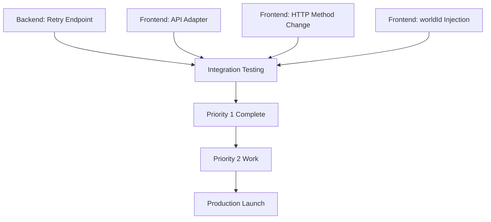

# Integration Action Items

## Frontend-Backend Compatibility (Spec 012 ↔ Spec 011)

**Status**: ⚠️ **BLOCKED** - Priority 1 items must be completed before integration  
**Report**: See [FRONTEND_BACKEND_COMPATIBILITY_REPORT.md](./FRONTEND_BACKEND_COMPATIBILITY_REPORT.md) for full analysis

---

## Summary

**The Good News**: ✅ Backend delete IS async (returns 202 Accepted, processes in background)  
**The Bad News**: ❌ Endpoint paths, HTTP methods, and response structures differ significantly  
**The Verdict**: Integration blocked until Priority 1 items complete (~2-4 days work)

---

## Priority 1: BLOCKING ISSUES (Must Fix Before Integration)

### 1.1 Backend: Implement Retry Endpoint ✋ BLOCKER

**What**: Add retry capability for failed delete operations  
**Why**: Frontend spec 012 requires retry per FR-014; users need to recover from failures  
**Endpoint**: `POST /api/v1/worlds/{worldId}/delete-operations/{operationId}/retry`

**Implementation Checklist**:

- [ ] Add `[HttpPost("{operationId:guid}/retry")]` action in `DeleteOperationsController`
- [ ] Implement `IDeleteService.RetryOperationAsync(worldId, operationId, cancellationToken)`
- [ ] Reset operation status from `failed`/`partial` → `pending`
- [ ] Clear error details and reset failed entity list
- [ ] Queue operation for reprocessing
- [ ] Return updated `DeleteOperationResponse` DTO
- [ ] Add unit tests for retry logic
- [ ] Add integration test for retry endpoint

**Estimated Effort**: 4-8 hours

---

### 1.2 Frontend: Create API Adapter Layer ✋ BLOCKER

**What**: Map frontend API calls to backend URL structure and transform responses  
**Why**: Frontend expects flat URLs without `worldId`, backend requires `worldId` in path  
**File**: `src/services/adapters/asyncOperationsAdapter.ts`

**Implementation Checklist**:

- [ ] Create `mapDeleteOperationToAsyncOperation()` utility function
  - Maps `DeleteOperationResponse` → `AsyncOperation`
  - Handles field name differences (RootEntityId → targetEntityId)
  - Computes `progress` object from backend fields
  - Computes `result` object from backend fields
  - Maps `"partial"` status → `'failed'` with partial success indicator
  - Hardcodes `type: 'DELETE'`
- [ ] Create `buildBackendUrl()` utility function
  - Transforms `/api/async-operations/{id}` → `/api/v1/worlds/{worldId}/delete-operations/{id}`
  - Transforms `/api/world-entities/{id}/async-delete` → `/api/v1/worlds/{worldId}/entities/{id}`
  - Injects `worldId` from Redux state (`selectCurrentWorldId`)
- [ ] Update `asyncOperationsApi.ts` to use adapter functions
- [ ] Add unit tests for mapping logic
- [ ] Add unit tests for URL transformation

**Estimated Effort**: 8-16 hours

**Code Reference**: See example in compatibility report section "Example: Frontend API Adapter"

---

### 1.3 Frontend: Change Delete HTTP Method ✋ BLOCKER

**What**: Change from POST to DELETE for delete initiation  
**Why**: Backend uses RESTful DELETE method, not POST  
**File**: `src/services/asyncOperationsApi.ts`

**Change**:

```diff
initiateAsyncDelete: builder.mutation<InitiateAsyncDeleteResponse, string>({
  query: (entityId) => ({
    url: `/api/world-entities/${entityId}/async-delete`,
-   method: 'POST',
+   method: 'DELETE',
  }),
```

**Estimated Effort**: 5 minutes

---

### 1.4 Frontend: Inject worldId Parameter ✋ BLOCKER

**What**: Provide `worldId` in all API calls that require it  
**Why**: Backend endpoints require `{worldId}` path parameter  
**Location**: All `asyncOperationsApi` endpoint queries

**Implementation**:

- [ ] Update `getAsyncOperations` query to accept `worldId` parameter
- [ ] Update `getAsyncOperation` query to accept `{ worldId, operationId }` parameters
- [ ] Update `retryAsyncOperation` mutation to accept `{ worldId, operationId }` parameters
- [ ] Update `initiateAsyncDelete` mutation to accept `{ worldId, entityId }` parameters
- [ ] Update NotificationCenter component to pass `worldId` from Redux state
- [ ] Ensure `worldId` is available in Redux (`selectCurrentWorldId` selector)

**Estimated Effort**: 2-4 hours

---

## Priority 2: PRODUCTION READINESS (Complete Before Launch)

### 2.1 Frontend: Implement Response Mapping

- [ ] Create comprehensive test suite for `mapDeleteOperationToAsyncOperation`
- [ ] Handle `partial` status → `'failed'` with clear partial success indicator
- [ ] Handle missing fields gracefully (targetEntityType, currentItem, etc.)
- [ ] Test with all status values: pending, in_progress, completed, partial, failed

**Estimated Effort**: 4-6 hours

---

### 2.2 Backend: Add `type` Field to DeleteOperation

**Why**: Frontend expects operation type for extensibility (DELETE, CREATE, UPDATE, etc.)

- [ ] Add `public string Type { get; set; }` to `DeleteOperation` entity
- [ ] Default to `"DELETE"` in factory method
- [ ] Add to `DeleteOperationResponse` DTO
- [ ] Update EF Core configuration
- [ ] Add database migration
- [ ] Update all tests

**Estimated Effort**: 2-4 hours

---

### 2.3 Frontend: Client-Side Filtering

**Why**: Backend only supports `limit` parameter; frontend expects status/type filtering

- [ ] Implement status filtering in frontend after fetching operations
- [ ] Implement type filtering in frontend after fetching operations
- [ ] Consider performance impact for large operation lists

**Estimated Effort**: 2-3 hours

---

### 2.4 Frontend: Remove Cancel Feature (Temporary)

**Why**: Backend doesn't support cancellation; defer to Phase 2

- [ ] Remove `cancelAsyncOperation` mutation from `asyncOperationsApi.ts`
- [ ] Remove cancel button from NotificationCenter UI
- [ ] Remove cancel-related types from `asyncOperations.ts`
- [ ] Update tests to remove cancel scenarios

**Estimated Effort**: 1-2 hours

---

## Priority 3: FUTURE ENHANCEMENTS (Post-Launch)

### 3.1 Backend: Implement Cancel Endpoint

- Endpoint: `POST /api/v1/worlds/{worldId}/delete-operations/{operationId}/cancel`
- Sets status to `cancelled`, stops background processing
- Partial commit semantics apply (already-deleted entities remain deleted)

**Estimated Effort**: 4-8 hours

---

### 3.2 Backend: Add User-Scoped Operation List

- Endpoint: `GET /api/v1/async-operations` (no worldId required)
- Queries all operations across all user's worlds
- Simplifies frontend logic (no need to inject worldId)

**Estimated Effort**: 4-6 hours

---

### 3.3 Backend: Add Estimated Completion Time

- Calculate based on entity count and average processing rate
- Add `EstimatedCompletionAt` field to `DeleteOperationResponse`
- Update progress calculation logic

**Estimated Effort**: 2-4 hours

---

### 3.4 Backend: Migrate to RFC 7807 Problem Details

- Replace custom `ErrorResponse` with standard `ProblemDetails`
- Aligns with industry standard and frontend expectations
- Update all error responses

**Estimated Effort**: 4-8 hours

---

### 3.5 Both: Migrate to Server-Sent Events

- Remove polling logic (high chattiness)
- Backend pushes status updates to frontend
- Reduces server load and improves real-time responsiveness

**Estimated Effort**: 16-24 hours (both teams)

---

## Dependencies & Timeline



**Critical Path**: All Priority 1 items must complete before integration testing  
**Estimated Timeline**: 2-4 days for Priority 1 (parallel work possible)

---

## Team Assignments

### Backend Team (Priority 1)

- [ ] Implement retry endpoint (Owner: TBD, 4-8 hours)

### Frontend Team (Priority 1)

- [ ] API adapter layer (Owner: TBD, 8-16 hours)
- [ ] HTTP method change (Owner: TBD, 5 minutes)
- [ ] worldId injection (Owner: TBD, 2-4 hours)

### Joint (Priority 1)

- [ ] Integration testing (Both teams, 4-8 hours)
- [ ] Auth token verification (Both teams, 1-2 hours)

---

## Testing Checklist

### Unit Tests

- [ ] Backend: Retry endpoint success case
- [ ] Backend: Retry endpoint validation (cannot retry completed operation)
- [ ] Frontend: Response mapping for all status values
- [ ] Frontend: URL transformation for all endpoint types
- [ ] Frontend: worldId injection from Redux state

### Integration Tests

- [ ] Delete initiation returns 202 Accepted
- [ ] Polling updates show progress in real-time
- [ ] Partial failure shows correct counts
- [ ] Retry successfully restarts failed operation
- [ ] Auth token flow works end-to-end
- [ ] Error handling for 404, 403, 429 status codes

### E2E Tests

- [ ] User initiates delete via UI
- [ ] NotificationCenter shows operation in progress
- [ ] Operation completes and shows success
- [ ] Failed operation can be retried
- [ ] Optimistic UI update removes entity immediately

---

## Communication Plan

1. **Daily Sync** (15 min):
   - Backend: Retry endpoint progress
   - Frontend: Adapter layer progress
   - Blockers and dependencies

1. **Integration Ready Gate**:
   - All Priority 1 items complete
   - Unit tests passing
   - Code reviewed and merged

1. **Integration Session** (2-4 hours):
   - Both teams present
   - Run integration test suite
   - Debug any issues live
   - Document learnings

1. **Go/No-Go Decision**:
   - Integration tests passing
   - Performance acceptable (<2s for status updates)
   - No blocking bugs identified

---

## Risk Mitigation

| Risk | Likelihood | Impact | Mitigation |
|------|-----------|--------|------------|
| Retry endpoint complexity exceeds estimate | Medium | High | Start early, break into smaller tasks |
| Auth token flow doesn't work | Low | High | Verify early with manual testing |
| worldId not available in Redux | Low | Medium | Add worldId to Redux state immediately |
| Performance degradation with polling | Medium | Medium | Load test early, adjust polling interval if needed |
| Response mapping misses edge cases | Medium | Medium | Comprehensive unit test coverage |

---

## Success Criteria

**Priority 1 Complete When**:

- ✅ Backend retry endpoint deployed and tested
- ✅ Frontend adapter layer implemented and tested
- ✅ All API calls use correct HTTP methods and URLs
- ✅ Integration tests passing (all scenarios)
- ✅ No console errors or network failures
- ✅ Auth flow verified end-to-end

**Production Ready When**:

- ✅ Priority 1 + Priority 2 items complete
- ✅ E2E tests passing
- ✅ Performance testing complete (10+ concurrent operations)
- ✅ Accessibility testing complete (WCAG 2.2 Level AA)
- ✅ Documentation updated (API docs, user docs)

---

**Last Updated**: February 3, 2026  
**Next Review**: After Priority 1 items complete  
**Owner**: Integration Team Lead (TBD)
